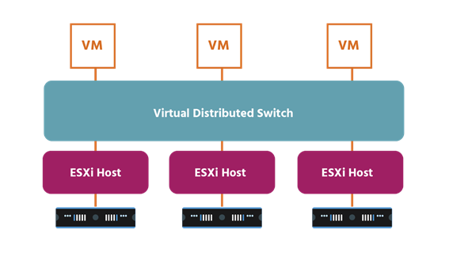
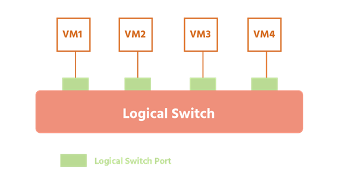
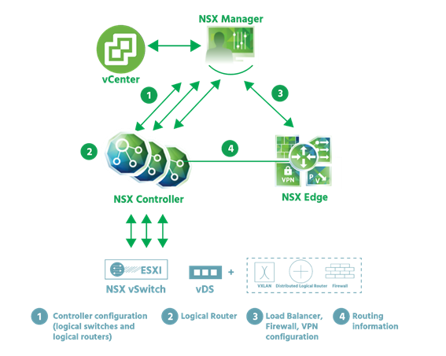

¡Bienvenido a los conceptos de virtualización de redes! Estamos encantados de presentarle los conceptos básicos de la virtualización de redes y esperamos que disfrute de este contenido tanto como nosotros hemos disfrutado creándolo para usted. Antes de comenzar, nos gustaría tomarnos un momento para explicar el alcance y el objetivo de este curso.

La red del futuro es definida por software. Es posible que ya haya oído hablar de la virtualización de redes y quisiera saber más, pero sintió que el material de aprendizaje disponible era demasiado avanzado o demasiado técnico. La virtualización de redes ciertamente puede ser compleja, pero hemos diseñado este curso para que sea una introducción para estudiantes principiantes con conocimientos previos limitados o nulos sobre el tema. Los conceptos de virtualización de redes lo guiarán paso a paso para desarrollar su comprensión de qué es la virtualización de redes, los principales componentes involucrados en ella y cómo el conocimiento en el tema puede conducir a grandes oportunidades profesionales.

## Objetivos del curso

Al final del curso, deberías ser capaz de

- Capacidades y beneficios de Articulate NSX
- describir los principales componentes de VMware NSX® en los planos de datos, administración y control, y sus interacciones.
- aplicar funciones relevantes de NSX a casos de uso
- Explicación de los componentes y servicios de virtualización de red de NSX
- explicar cómo se utiliza la virtualización de red en un entorno SDDC

## Resumen del curso

El microcurso de Conceptos de Virtualización de Redes consta de seis módulos:

- Módulo 1: ¡Bienvenidos!
- Módulo 2: Introducción a la virtualización de redes
- Módulo 3: El centro de datos definido por software
- Módulo 4: Servicio de virtualización de redes
- Módulo 5: El centro de datos de NSX
- Módulo 6: ¿A dónde ir desde aquí?

## Introducción a la virtualización de redes

Un mundo 5G tiene la virtualización en su núcleo. A medida que el número de dispositivos conectados aumenta de cientos de millones a decenas de miles de millones, los centros de datos dependen cada vez más de la infraestructura virtualizada para manejar el tsunami de datos que estamos produciendo y consumiendo. Y no se trata solo de los centros de datos: el hecho de que el 100% de las empresas de la lista Fortune 100 utilicen la virtualización (y la tecnología de virtualización de VMware), cuenta su propia historia.

En el centro de datos definido por software (SDDC), la infraestructura de procesamiento, redes y almacenamiento se virtualiza para que los recursos se puedan agrupar y usar de manera más eficiente, menos costosa y más rápida. Se han logrado avances reales en la virtualización de servidores (cómputo) y se ven cada vez más con la virtualización del almacenamiento.

Sin embargo, las eficiencias obtenidas de ellos se han visto limitadas hasta cierto punto por la infraestructura de red heredada (es decir, tradicional, no virtual) que todavía depende del hardware físico y principalmente de los procesos manuales. Si bien la computación y el almacenamiento virtualizados de una organización pueden ser dinámicos, ágiles y flexibles, sus redes heredadas simplemente no pueden seguir el ritmo. Y una infraestructura u organización que no puede mantenerse al día a menudo se queda atrás.

La virtualización de red permite la velocidad, la movilidad y la seguridad necesarias en un mundo 5G. La infraestructura puede estar lista para nuevas aplicaciones o cambiarse en minutos, en lugar de días o semanas. Las aplicaciones y las cargas de trabajo ya no están restringidas a subredes físicas individuales, ni tampoco conmutadores, enrutadores, firewalls, etc. El enfoque de la seguridad pasa de simplemente proteger el perímetro (la  _superficie exterior_) de la infraestructura de un centro de datos a proporcionar la capacidad de dar a cada máquina virtual y red virtual su propio firewall, cambiando el enfoque al  perímetro interior del centro de datos y reduciendo la superficie de ataque. Además, las redes virtuales están aisladas. y (como aprenderemos más adelante en este curso) segmentados entre sí y desde la infraestructura física subyacente para que las amenazas no se puedan propagar si llegan.

La virtualización de red extiende estas características y muchas otras también a la nube, un factor crítico para el 81% de las empresas que ahora utilizan múltiples modelos de implementación en la nube.

### ¿Qué es la virtualización de red?

La virtualización de red separa totalmente los recursos de red del hardware físico al recrear esos recursos de red en software, virtualizándolos. Los enrutadores físicos (que reenvían datos a través de múltiples redes), los conmutadores (que reenvían datos en una sola _red de área local_ o _LAN)_ y los equilibradores de carga (que igualan las cargas de trabajo para evitar que los servidores se vean abrumados) se virtualizan en la capa del hipervisor utilizando servidores estándar de la industria listos para usar (hosts de servidor/cómputo). A continuación, este grupo virtualizado se puede utilizar según sea necesario, bajo demanda. El hardware físico subyacente sigue siendo importante (todavía se usa para el reenvío), pero ya no es necesario volver a configurarlo cada vez que se agrega o actualiza una nueva máquina virtual o contenedor, o cada vez que un dispositivo de la red se mueve a una parte diferente de la red. Ahora toda la red se puede ejecutar en software.

Este software de red basado en hipervisor (que también incluirá servicios de seguridad) utiliza un **controlador** para enviar servicios de red a conmutadores virtuales y _adjunta_ los servicios a _máquinas virtuales (VM)_ y contenedores individuales. El resultado es una red virtual (los servicios exactos vendrán determinados por las directivas ya asignadas a la máquina virtual o los contenedores). En esta red virtual, cada vez que se crean nuevas máquinas virtuales y contenedores, se les aplican automáticamente las directivas adecuadas, y cuando las máquinas virtuales y los contenedores se mueven, sus redes y seguridad se mueven con ellos. (A veces escuchará que las máquinas virtuales y los contenedores se denominan _cargas de trabajo_, por lo que usaremos ese término aquí para familiarizarte con él).

La creación de una red virtual sobre una red física se conoce como **redes superpuestas**. Imagine dos dispositivos (o _puntos finales_) en la red de una organización:  el _portátil del departamento de finanzas_ y  el _portátil del departamento de ventas_, por ejemplo, ambos conectados a puertos de red físicos. (Las máquinas virtuales y los contenedores pueden ser _puntos finales_, también). A ambos equipos portátiles se les asigna un identificador de red virtual (_VNID_) y se les asigna a una red virtual. A continuación, los conmutadores virtuales conectan  _el portátil del departamento de finanzas_ con  el _portátil del departamento de ventas_ a través de enlaces virtuales (representaciones de software de enlaces físicos) que forman un túnel a través de la red. Cada enlace virtual corresponde a una ruta en la red física subyacente.

La virtualización de red funciona igual de bien en la nube y se puede gestionar mediante el uso de una plataforma de gestión de la nube (_CMP_) como _vRealize Automation de VMware_ o una opción de código abierto como _Apache CloudStack_ y _OpenStack_. La virtualización de red basada en hipervisor se puede configurar y ejecutar mediante una interfaz gráfica de usuario (_GUI)_ y una interfaz de línea de comandos (_CLI)_ o mediante interfaces de programación de aplicaciones (_API_).

La virtualización de red proporciona a los administradores una enorme flexibilidad. Se puede utilizar para redes tan pequeñas como dos dispositivos conectados, o tan grandes como redes que abarcan varios sitios de grandes empresas. Además, es lo suficientemente flexible como para trabajar con cualquier nube o clúster (o pod si usa un nuevo marco de aplicaciones como _Kubernetes_) mientras tiene diferentes redes virtuales que se pueden asociar con diferentes cargas de trabajo.  **El producto de seguridad y red virtual NSX for vSphere** (NSX-V) de VMware funciona con ESXi (un hipervisor de tipo 1, es decir, que se ejecuta directamente en el hardware del host, independientemente del sistema operativo del host), mientras que su **centro de datos NSX-T** funciona con ESXi y con KVM (un hipervisor de tipo 2 que se ejecuta dentro del sistema operativo del host).

Las redes virtuales no deben confundirse con _las redes de área local virtual_ (VLAN). Una VLAN toma los puertos de un switch físico y los agrupa (o aísla) para que se ajusten a un propósito específico. Una organización puede tener su Departamento de Finanzas en el primer piso, Recursos Humanos en el segundo y tercero, Producción en el cuarto, Ventas en el quinto e impresoras repartidas por todo el edificio. En un conmutador físico, se pueden crear cinco VLAN para estas funciones separadas, cada una con su propio _dominio de transmisión_.

.

Sin embargo, solo se puede crear un máximo de 4096 VLAN en una red de capa 2. (Esta es una referencia a la **Modelo de red** OSI, que tiene 7 capas que juntas describen las diferentes funciones de comunicación de un sistema de red). Esto puede parecer mucho, pero imagínese ser una empresa que le da a cada uno de sus clientes 5 VLAN: después del cliente 819 no tendría más VLAN, lo que significaría que no tendría nuevos clientes. La seguridad es un problema, ya que las VLAN están separadas desde una perspectiva lógica, pero en realidad se ejecutan a través de la misma conexión, y una violación de seguridad en una puede afectarlas a todas. Y cada vez que se extiende una VLAN, se necesita una configuración física que requiere mucho tiempo.

Con la virtualización de red, por otro lado, también están disponibles servicios de red más allá de la transferencia de datos: conmutación, enrutamiento, firewall y equilibrio de carga (funciones de capa 3 a capa 7). La red en su totalidad (Finanzas, Recursos Humanos, Producción, Ventas e impresoras) se puede recrear en el software en segundos y clonar o mover si es necesario; O  _bien, se_ pueden crear, guardar y utilizar instantáneas que representan el estado exacto de una red en un momento determinado para recrear la red si es necesario. Todos los servicios de red y seguridad se virtualizan (se manejan en software) y se conectan directamente a las cargas de trabajo individuales, lo que reduce la necesidad de configuración física.

### ¿Qué son las redes definidas por software?

La virtualización de red y las _redes definidas por software (SDN)_ se derivan de una búsqueda común, el objetivo de una mayor agilidad de la red, y aún comparten ciertos rasgos:

- Ambos utilizan software para recrear componentes clave de la infraestructura de red
- Ambos separan el **plano de control** (la parte de la red que lo administra y controla, el _cerebro de una red_) del plano de **datos** (la parte donde fluye el tráfico de datos, los músculos de una red) Esto significa que tanto con la virtualización de red como con SDN, el control de red se puede programar directamente para aplicaciones y servicios de red, sin necesidad de configuración manual.
- Ambos utilizan un **controlador** que ejecuta software especializado para centralizar la gestión de la red.
- Ambos (en diversos grados) cumplen con el objetivo principal de aumentar la agilidad al permitir a los administradores ajustar de forma rápida y precisa el flujo de tráfico de datos a través de una red.

Con el tiempo, sin embargo, SDN se ha definido de manera más amplia que la virtualización de red, lo que significa cosas diferentes según con quién hable y cómo estén usando SDN. El hilo que une estas diferentes definiciones es _el uso de software por parte de SDN para controlar redes y sus dispositivos físicos._ Con SDN, el software controla los conmutadores de red y los enrutadores, pero la red no está completamente virtualizada, como ocurre con la virtualización de red (componentes, configuraciones, funciones y todo). A menudo, el hardware sigue desempeñando un papel importante en una red SDN.

### Redes Internacionales en Redes Físicas

La virtualización de red le permite ver su red física actual desde una nueva perspectiva, una en la que ya no está restringido a las capacidades de su hardware. El software amplía enormemente su gama de posibilidades, recreando su hardware como un grupo virtualizado que luego se puede utilizar según sea necesario, bajo demanda.

Imagine que su red física duplica su alcance: su red física está ahí haciendo el trabajo que siempre se ha hecho, pero en paralelo con ella ahora tiene una versión virtual idéntica que se ejecuta de forma independiente. al lado o _encima_ de ella. Una vez que se ha creado esa red virtual, se puede guardar, cerrar y restaurar más adelante, posiblemente en otro sitio. O se puede eliminar por completo.

Ahora imagine el alcance de su red física triplicado, cuadruplicado o más, Debido a que la virtualización separa las redes del hardware subyacente, puede crear tantas redes virtuales (copias de la red física) como necesite. Cada una de estas redes virtuales se ejecuta de forma espléndida y aislada, sin verse afectada por eventos en otras redes virtuales o en el centro de datos.

### Puente entre las redes virtualizadas y las VLAN tradicionales

Como mencionamos en la sección 2.1, la creación de una red virtual sobre una red física se conoce como **redes superpuestas**. La infraestructura subyacente se convierte en la _capa subyacente_, también conocida como red física (capa 3). Existen varias metodologías de superposición. Dos de las más utilizadas son la **Red de Área Local Extensible Virtual** (VXLAN) y  la **Encapsulación de Virtualización de Red Genérica** (GENEVE). Es importante tener en cuenta que VXLAN es neutral con respecto al proveedor y ha sido reconocida como RFC (Solicitud de comentarios) 7348, que es un documento formal del Grupo de Trabajo de Ingeniería de Internet (IETF).

VXLAN funciona en hardware (por ejemplo, en enrutadores o conmutadores), en software (por ejemplo, en un hipervisor) o en ambos (híbrido). Utiliza identificadores binarios de 24 bits (desde 000000000000000000000 hasta 111111111111111111111111 y todo lo demás), lo que significa que es posible un máximo de 16.777.215 VXLAN. ¡Compare eso con el máximo de 4096 VLAN permitidas por sus identificadores de 12 bits! Un ID de VXLAN se denomina identificador de **red VXLAN** (VNI). Cada VNI es una red virtual independiente que se ejecuta en la red superpuesta, que también se conoce como **dominios puente**.

**Los puntos finales de túnel VXLAN** (_VTEP_) conectan la red física a la red superpuesta. Cada VTEP tiene una dirección IP en la red física y uno o más VNI en la red superpuesta. El tráfico encapsulado (tráfico al que se le ha agregado cierta información en etapas clave de su recorrido; consulte la sección 4) se transfiere entre hosts a través de un túnel sin estado que se crea entre un VTEP de origen y un VTEP de destino. En el momento en que los datos de un host llegan a un conmutador VXLAN, lo hacen en forma de tramas, específicamente "tramas MAC internas" que incluyen información y datos de direcciones MAC (es decir, hardware). Los switches agregan un "encabezado VXLAN" que contiene el VNI de 24 bits.

A continuación, el VTEP de origen agrega la _dirección IP_ del VTEP de destino en un encabezado IP, así como su propia dirección IP. Agrega un  encabezado **de protocolo de datos de usuario** (UDP) (UDP es el protocolo de transporte que utiliza VXLAN). La dirección MAC del siguiente dispositivo físico al que se entregará la trama en su viaje se agrega en un _encabezado Ethernet_. La red física (el calco subyacente) reenvía la trama encapsulada al VTEP de destino, que elimina los encabezados en un proceso llamado **desencapsulación** (mencionado nuevamente en la sección 4). A continuación, la trama se entrega al host de destino.

GENEVE es un participante relativamente nuevo en el campo del protocolo de túneles. Fue desarrollado y redactado conjuntamente como una propuesta del IETF por Intel, Microsoft, Red Hat y VMware y lanzado en 2014. En el momento en que se escribió este microcurso, GENEVE estaba pasando por el proceso del IETF para convertirse en una RFC en sí misma, por lo que GENEVE es igualmente neutral con respecto al proveedor. Funciona de forma casi idéntica a VXLAN, pero es más flexible porque ofrece independencia del plano de control entre los puntos finales del túnel. Y hay una ligera diferencia en la terminología: GENEVE no tiene VTEP (puntos finales de túnel VXLAN), solo puntos finales de túnel (TET).

Es importante tener en cuenta que NSX-V utiliza la encapsulación de superposición de VXLAN y NSX-T utiliza GENEVE.

## El centro de datos definido por software (SDDC)

Con 2.500 millones de bytes de datos que se producen actualmente en todo el mundo cada día y la cantidad de datos almacenados en todo el mundo que se duplica cada dos años, es fácil ver por qué los centros de datos están creciendo en importancia. También está claro por qué aumentar la eficiencia (en términos de sistemas y mano de obra) y salvaguardar el tiempo de actividad (el número de sistemas que funcionan sin problemas y están disponibles) son dos de sus principales prioridades

Tradicionalmente, los centros de datos han estado "centrados en el hardware", es decir, centrados en equipos físicos y dependientes de ellos. Y este hardware ha sido muy a menudo fabricado por proveedores que cobran mucho por la compra inicial (especialmente si el hardware ha sido hecho a medida), por el mantenimiento y por las actualizaciones. Esto no solo ha sido costoso desde el punto de vista financiero, sino que también se ha producido a costa de la flexibilidad y la agilidad en un panorama empresarial que cambia rápidamente.

Afortunadamente, todos los servicios principales de un centro de datos se pueden virtualizar. Impulsado por VMware, el **centro de datos definido por software** (_SDDC_) extiende la virtualización más allá de la computación (es decir, servidores) a la red y el almacenamiento. Todos los recursos y servicios del centro de datos se definen por software.

El costoso hardware específico del proveedor se reemplaza por hardware asequible _y estándar de_ la industria. Debido a que los sistemas virtualizados se pueden copiar y guardar, se pueden reproducir fácilmente en caso de una falla del sistema. Y con la automatización, esta reproducción puede ser casi inmediata, lo que significa menos tiempo de inactividad

En el centro de datos definido por software, el hipervisor es el controlador. Agrupa los recursos de hardware que se pueden asignar con precisión cuando y donde más se necesitan.

El software de gestión que utiliza políticas predefinidas simplifica enormemente las operaciones del SDDC. Todas las aplicaciones, independientemente de dónde se encuentren, se pueden supervisar y gestionar de forma centralizada. Se pueden configurar, ejecutar y administrar diferentes tipos de cargas de trabajo (máquinas virtuales o contenedores, por ejemplo) en diferentes tipos de entorno (físico, virtual o en la nube) utilizando el mismo software de administración. Y con la automatización, se necesitan muchas menos personas para hacer esto.

### Centros de datos físicos

Cada bit de información al que accede en un dispositivo es el resultado de una transferencia de datos entre el lugar donde se procesa y almacena la información y el dispositivo al que se envían los datos. Ya sea que esté buscando un buen restaurante o el mejor precio en un libro de texto, la información que encuentra proviene de un sitio web que aloja su contenido en un centro de datos. Hoy en día, la mayoría de las personas confían en Internet para obtener la mayor parte de su información sobre el mundo que les rodea, y la mayoría de las empresas dependen de él para llegar a una buena proporción de sus clientes. Es por eso que la eficiencia y la agilidad en los centros de datos son tan vitales.

A menudo se supone que los centros de datos son grandes estructuras del tamaño de un almacén propiedad de una gran corporación o un gobierno, pero también pueden ser configurados in situ por pequeñas empresas y las propias empresas. Estos centros de datos albergan sistemas informáticos, llamados servidores, que se utilizan para compartir o calcular datos para clientes como un usuario de teléfono inteligente o un sitio web comercial más rápido de lo que podría hacerlo una computadora normal.

La infraestructura del centro de datos consta de tres componentes principales: sistemas informáticos (un servidor o host), dispositivos de almacenamiento y redes. En un centro de datos físico, todo esto será hardware, y se necesitan cantidades masivas para todos los datos que circulan actualmente. En 2016, por ejemplo, se estimó que Google tenía 2,5 millones de servidores en ese momento.

Una gestión eficaz significa supervisar la disponibilidad, la capacidad y el rendimiento de los datos, y proporcionar una sólida seguridad de los datos (así como una gestión de la energía, sistemas de refrigeración eficaces y medidas de seguridad).

Como se mencionó en la última sección, los centros de datos físicos son inflexibles. También son costosos de mantener con múltiples procesos manuales y operaciones desconectadas. Incluso con la virtualización de computación y almacenamiento, las aplicaciones siguen estando vinculadas a la infraestructura de red física. Sin la virtualización de la red, las operaciones del centro de datos seguirán siendo muy manuales y, por lo tanto, lentas y costosas.

### Centros de datos virtualizados

Los centros de datos definidos por software resuelven los problemas de costo, complejidad, ineficiencia e inflexibilidad que plantean los centros de datos físicos. Un SDDC totalmente virtualizado abarcará la computación, el almacenamiento, la infraestructura de red y la gestión de la nube, lo que hará que los servicios del centro de datos sean tan económicos y fáciles de configurar y gestionar como las máquinas virtuales. El alejamiento del hardware específico del proveedor no solo reduce las facturas de compra y mantenimiento, sino que también elimina la necesidad de una costosa capacitación sobre cómo usar este hardware altamente especializado y, a menudo, hecho a medida.

La principal ventaja de la virtualización en el SDDC es la capacidad de reunir recursos físicos como la CPU, la memoria, el almacenamiento y la E/S de red (transferencia de datos de un dispositivo a otro) en grupos lógicos (es decir, no físicos), que luego se pueden asignar a máquinas virtuales individuales o contenedores (cargas de trabajo).

El uso de software de gestión y automatización significa que estos recursos virtualizados se pueden proporcionar rápidamente cuando sea necesario y ajustarse a medida que cambian las necesidades. El uso de políticas (reglas predefinidas) significa que esto se puede hacer con consistencia y precisión. La automatización tiene la ventaja adicional de liberar al personal altamente cualificado de las tareas repetitivas para dedicarlo a actividades más productivas y de valor añadido.

La información se puede recopilar del entorno del centro de datos (utilizando, por ejemplo, _vRealize Operations Manager de VMware_, que proporciona una gestión automatizada de operaciones para infraestructuras físicas, virtuales y en la nube) y utilizarse para planificar la capacidad futura con mayor precisión.

La virtualización de red separa los conmutadores, enrutadores y servicios de red de la red física subyacente. La plataforma de virtualización de red de VMware es _NSX_. Cierra la brecha entre las redes físicas y las aplicaciones, reduce la complejidad y los costos del hardware, mejora la disponibilidad de las aplicaciones (tiempo de actividad) y acelera la recuperación del sistema.

### Enfoque de SDDC de VMware

El software impulsa el crecimiento y el desarrollo de las redes y la infraestructura de los centros de datos. VMware es el creador de la agilidad definida por software, con aprovisionamiento instantáneo desde el centro de datos hasta los dispositivos. Sus tecnologías proporcionan seguridad avanzada integrada en (o _nativa)_ aplicaciones, dispositivos e infraestructura, y unifican a la perfección las nubes privadas y públicas. Con el enfoque SDDC, las organizaciones pueden satisfacer sus demandas comerciales de manera eficiente y flexible, al tiempo que ahorran costos a largo plazo. vSphere de VMware para la virtualización de servidores, vSAN para la virtualización del almacenamiento y NSX para la virtualización de redes son solo algunos de los productos que ayudan a sus más de medio millón de clientes a lograr estos beneficios. (Vamos a ver el _NSX Data Center_ en detalle en la sección 5).

Cada vez son más las organizaciones que optan por mezclar y combinar sus nubes para maximizar la eficacia de sus gastos y recursos. La combinación más común de nubes privadas locales con nubes públicas, y el término utilizado para describir este enfoque de "lo mejor de ambos mundos" es _nubes híbridas_. Una estrategia de nube híbrida es parte integral de la visión de VMware de ayudar a sus clientes a usar cualquier nube para entregar cualquier aplicación a cualquier dispositivo. Además, dado que la mayoría de las empresas aún no han virtualizado completamente sus infraestructuras de computación, almacenamiento y red, las tecnologías de VMware se pueden reunir en conjuntos de software integrados de forma nativa (SDDC in-a-box). A  _su vez, los conjuntos (o pilas_, como se les conoce) como _VMware Cloud FoundationTM_ simplifican mucho la implementación de nubes híbridas. _Los servicios Cloud FoundationTM_ y _Cross-CloudTM_ (conocidos en conjunto como _arquitectura multinube de VMware_) respaldan la estrategia de nube híbrida de VMware.

VMware se ha asociado con _Amazon Web Services_ (AWS) para ofrecer _VMware Cloud on AWS_ (SDDC as a Service), en el que se puede utilizar un único conjunto de herramientas de software para gestionar tanto las nubes privadas locales como las públicas. Este enfoque combina las amplias capacidades de computación, almacenamiento, redes y seguridad de VMware y AWS en un servicio flexible y fácil de usar.

En pocas palabras, he aquí por qué VMware cree que su SDDC ofrece lo que nadie más puede:

- La tecnología SDDC significa que se puede utilizar una mayor parte de la infraestructura de una organización la mayor parte del tiempo, lo que a su vez hace que su personal sea más productivo y reduce en gran medida el gasto en equipos físicos (conocido como _gasto de capital_ o CapEx) y en costos operativos (OpEx).
- El SDDC permite la implementación de aplicaciones en minutos o incluso segundos con un aprovisionamiento basado en políticas que adapta los recursos a las cargas de trabajo y a las demandas empresariales que cambian continuamente.
- El SDDC hace posible la disponibilidad, la seguridad y el cumplimiento adecuados para cada aplicación.
- El SDDC es compatible con nubes privadas, públicas e híbridas. En cada caso, la infraestructura se abstrae completamente de las aplicaciones para que puedan ejecutarse en múltiples conjuntos de hardware, hipervisores y nubes.

El resultado de un SDDC totalmente virtualizado es una agilidad y eficiencia de TI sin precedentes, con la flexibilidad necesaria para soportar el hardware y las aplicaciones actuales y futuras.

### Bloques de construcción del centro de datos

Con todos los componentes, no habrá dos centros de datos iguales. Sin embargo, algunos de los componentes clave que incluirá un centro de datos empresarial (es decir, a gran escala) son las aplicaciones, los servidores, el almacenamiento, la infraestructura de red, la gestión y la automatización

A medida que aumenta el papel de la virtualización en los centros de datos, estos bloques de construcción clave pueden tener un aspecto diferente. Actualmente, esperaríamos que un  _centro de datos totalmente virtualizado_:

- Ser definido por software: automatizado y gestionado por un único conjunto de herramientas de software basadas en políticas que le permiten supervisar y administrar de forma centralizada todas las aplicaciones en diferentes entornos (físicos, virtuales y en la nube) y tipos de infraestructura
- Tienen seguridad incorporada
- ser muy fácil de ajustar en tamaño, ya sea _escalando horizontalmente/adentro_ agregando / eliminando dispositivos, o escalando _hacia arriba / abajo_ agregando / eliminando recursos como CPU o almacenamiento a un solo dispositivo
- Admita los últimos desarrollos en tecnología de aplicaciones, como contenedores y aplicaciones diseñadas específicamente para la nube
- Infraestructura de soporte  como código, es decir, admite la escritura de código que se encarga de la configuración y automatiza el aprovisionamiento.

Estos componentes cambiarán a medida que el SDDC crezca y se desarrolle. Desde la aparición de la virtualización en la década de 1960, con la informática B5000 de Burroughs Corporation y los ordenadores centrales de IBM, ha cambiado el mundo. Es probable que los servidores hayan experimentado la mayor innovación, con beneficios tangibles que incluyen la reducción de la complejidad física, el aumento de la eficiencia operativa y la simplificación de la reutilización (es decir, la virtualización) de los recursos físicos subyacentes. Hoy en día la gran mayoría de los servidores están virtualizados y, en términos de redes, ahora se utilizan más puertos virtuales a nivel global que los físicos.

Con una amplia gama de productos de gestión y automatización de centros de datos (_vSphere_, _vRealize_ y _NSX_, por nombrar solo tres), VMware sigue innovando para sus clientes actuales y futuros.

## Servicios de virtualización de red

Antes de examinar los servicios de virtualización de red, creemos que puede ser útil una descripción general rápida del modelo de **interconexión de sistemas abiertos** (_OSI)._

En este modelo de red de 7 capas, los datos se transfieren del _host A_ al _host B_ en segmentos, paquetes, tramas y bits.

En las capas 7, 6 y 5, los datos se denominan simplemente **datos**.

En  _la capa 4_ (la capa de **transporte**), los datos se dividen en fragmentos más pequeños. Se lleva a cabo un proceso llamado **encapsulación** en el que la información se agrega a los datos a medida que se mueven de una capa a otra. Esta información (cuyo contenido preciso variará de una capa a otra) se denomina **encabezado**. En la capa 4, una vez que se agrega un encabezado a los datos, los datos se denominan **segmento**. Su encabezado contendrá los números de puerto para las aplicaciones que utilizarán los datos en el Host B. La Capa 4 luego pasa cada segmento a la Capa 3.

En  _la capa 3_ (la **capa de red**), los datos se transfieren de una dirección de protocolo de **Internet** (_IP_) a otra a través de un enrutador. Cada segmento que se haya transmitido desde la capa 4 se encapsulará con información de origen (dirección IP del host A), información de destino (dirección IP del host B), un número de identificación, otro número que identifique en cuántas partes se ha dividido la información que se envía (la **carga útil**) y parte de esa información. Una vez que se adjunta el encabezado, el segmento se denomina **paquete**. La capa 3 entrega el paquete a la capa 2.

_La capa 2_ (la capa de **enlace** de datos) es responsable de la transferencia de datos sin errores de un dispositivo a otro. Los paquetes se encapsulan con las direcciones de control de acceso a medios (MAC) del host A y el host B, así como con  **el control de enlace lógico** (_LLC_) que mantiene el enlace entre los dispositivos a medida que transmiten datos a través de la conexión de red física. Cada paquete también se encapsula con un **pie de página** (o _finalizador_), que contiene información de detección de errores. Con su encabezado y pie de página/remolque conectados, el paquete se denomina _trama_. La Capa 2 transfiere el marco a la Capa 1.

_La capa 1_ es la **capa física** que consta de cables y conexiones físicas. Convierte las tramas en bits binarios  en forma de voltaje para cables físicos y señales de radio para conexiones inalámbricas.

La Capa 1 del Host A reenvía estos bits a la Capa 1 del Host B, que los entrega a la Capa 2 del Host B. La capa 2 del host B **desencapsula** el marco (eliminando su encabezado y pie de página/finalizador) antes de pasarlo a la capa 3, donde se produce nuevamente la desencapsulación. Este proceso se repite hasta que se entregan los datos completamente desencapsulados.

En las redes superpuestas utilizadas por la virtualización de red, los puntos de conexión conectan la red física (la capa subyacente) a la red superpuesta. El tráfico encapsulado se transfiere entre hosts a través de un túnel sin estado (es decir, no se realizan conexiones TCP con el túnel) que se crea entre el punto de conexión de origen y el punto de conexión de destino.

### Redes virtuales

Como hemos comentado anteriormente, en las redes virtuales, algunos o todos los componentes de hardware se reemplazan por componentes de red virtual que se reemplazan por componentes de red virtual compuestos por software. Esto elimina la necesidad de configurar físicamente los componentes de hardware físicos. Los componentes de la red virtual se pueden configurar más fácilmente que los componentes físicos, lo que permite administrar la red de máquinas virtuales con mayor facilidad y flexibilidad.

Las máquinas virtuales deben estar conectadas a un componente de red virtual y ese componente virtual debe tener acceso a la red física. Hay varias formas en que los componentes virtualizados se pueden conectar a una red física para permitir que las máquinas virtuales se comuniquen entre sí y con otros dispositivos. En esta sección se exploran los tres tipos de red principales que se usan para configurar máquinas virtuales con una conexión en un escenario de hipervisor de tipo 2 (que es un hipervisor que se ejecuta en un sistema operativo host). Piense en VMware Workstation y/o Fusion.

**Red puenteada**

Una **red puenteada** es un tipo de red en el que tanto una máquina virtual como el host en el que se ejecuta están conectados a la misma red. Las redes puenteadas conectan una máquina virtual a la red mediante el adaptador Ethernet del equipo host (también conocido como _tarjeta de interfaz de red_ o _NIC_). Esto es posible porque el host comparte su dirección IP con la máquina virtual.

Con las redes puenteadas, el adaptador de red virtual (vNIC) de la máquina virtual se conecta a una NIC física en el sistema host físico. El adaptador de red host permite que la máquina virtual se conecte a la red de área local (LAN) que usa el sistema host. Las redes puenteadas funcionan con adaptadores de red host cableados e inalámbricos.

**Nota**: Los términos tarjeta de interfaz de red (NIC) y adaptador de red se utilizarán indistintamente en esta sección.

Las redes puenteadas tratan la máquina virtual como una identidad única en la red, independiente y no relacionada con el sistema host. La máquina virtual es un participante de pleno derecho en la red. Tiene acceso a otras máquinas de la red, y otras máquinas de la red pueden contactar como si fuera una computadora física de la red.

**Red NAT**

**La traducción de direcciones de red** (NAT) toma una dirección IP y la traduce en otra dirección IP. En una red NAT, una máquina virtual no tiene su propia dirección IP en la red externa. En su lugar, se configura una red privada separada localmente en el equipo host.

NAT es útil cuando tiene un suministro limitado de direcciones IP. NAT funciona traduciendo las direcciones de las máquinas virtuales en una red privada llamada **VMnet** a la de la máquina host. Cuando una máquina virtual envía una solicitud para acceder a un recurso de red, al recurso de red aparece como si la solicitud proviniera de la máquina host.

El dispositivo NAT de la red traduce la información que va a la dirección IP pública del host y la reenvía a la dirección IP privada de las máquinas virtuales.

VMnet puede conectarse a la red externa pública mediante las direcciones IP traducidas habilitadas por una función denominada **reenvío de puertos**. El reenvío de puertos permite que el tráfico web entrante pase a través de un puerto específico, elegido por el administrador, a la red interna.

El dispositivo NAT es capaz de ordenar los paquetes de datos destinados a cada máquina virtual y enviarlos al destino correcto. Cuando un paquete no llega a su destino, esto se denomina _pérdida de paquetes_.

La topología (es decir, el diseño físico y lógico) de una red NAT generalmente implica una máquina virtual conectada a una vNIC que le permite conectarse al conmutador virtual (vSwitch). El vSwitch también está conectado a un dispositivo NAT que traduce las direcciones IP y permite que el reenvío de puertos se conecte a la red externa.

**Tenga en cuenta lo siguiente**: En la configuración predeterminada, las máquinas virtuales obtienen una dirección en esta red privada del servidor DHCP virtual. DHCP es un acrónimo de **Dynamic Host Control Protocol**. Un servidor DHCP es un sistema que utiliza el protocolo DHCP para asignar direcciones IP a los dispositivos de la red.

**Red de solo host**

**Las redes de solo host** crean una red interna privada a la que se conectan las máquinas virtuales, similar a una red NAT. Sin embargo, sin la traducción de direcciones IP, las máquinas virtuales solo pueden permanecer en la red privada y no tienen acceso directo a la red externa pública.

Las redes de solo host proporcionan una conexión de red entre la máquina virtual y otras máquinas virtuales de la misma red de solo host, mediante un adaptador Ethernet virtual (vNIC) visible para el sistema operativo host. Este enfoque puede ser útil si necesita configurar una red virtual aislada.

Si utiliza redes de solo host, la máquina virtual y el adaptador virtual de host están conectados a una red Ethernet privada. Las direcciones de este tipo de red también son proporcionadas por un servicio DHCP.

### Conmutadores virtuales

En el núcleo de las redes de vSphere se encuentran los conmutadores virtuales (vSwitches). Permiten que las máquinas virtuales se conecten entre sí y se conecten con el mundo exterior. De forma predeterminada, cada host ESXi tiene un único conmutador virtual denominado _vSwitch0_.

La conexión entre una máquina virtual y un conmutador virtual es similar a la conexión entre el adaptador de red (NIC) físico de un equipo y un conmutador físico. Pero en lugar de usar un cable Ethernet con cable, la máquina virtual está conectada al puerto del conmutador virtual mediante un cable virtual.

Al igual que con un conmutador físico, las tramas de capa 2 entran y salen de un conmutador virtual. Al igual que con un conmutador físico, un vSwitch tiene puertos organizados en grupos de puertos. Al igual que con un conmutador físico, un vSwitch tiene puertos de enlace ascendente. Estos son puertos de adaptador de red físicos que se encuentran dentro del host ESXi y conectan el conmutador virtual dentro del host ESXi a un conmutador físico:

Los enlaces ascendentes conectan el conmutador virtual con el mundo físico: mueven los 0 y 1 físicos del host y los llevan al mundo. Un conmutador virtual puede tener uno o más enlaces ascendentes. Del mismo modo que puede conectar los puertos de enlace ascendente entre los dos conmutadores físicos en el mundo virtual, puede conectar o vincular un conmutador virtual a un conmutador físico.

Los vSwitches le permiten realizar ajustes en sus _redes de área local virtual (VLAN),_ en algunas de sus configuraciones de seguridad, en su equilibrio de carga y en sus _unidades máximas de transmisión (MTU),_ que se relacionan con el tamaño de las tramas de datos, así como con otras configuraciones que están más allá del alcance de este curso.

### Interruptores estándar

vSphere admite dos tipos de conmutadores virtuales: el **conmutador virtual estándar** (vSwitch o _VSS)_ y el **conmutador virtual distribuido** (o _VDS)._

Un conmutador estándar funciona de forma muy parecida a un conmutador Ethernet físico. Detecta qué máquinas virtuales están conectadas lógicamente a cada uno de sus puertos virtuales y utiliza esa información para reenviar el tráfico a las máquinas virtuales correctas. Un conmutador estándar puede reenviar el tráfico internamente entre máquinas virtuales dentro del mismo host ESXi, entre máquinas virtuales en diferentes hosts ESXi y entre máquinas virtuales y máquinas físicas, y puede vincularse a redes externas.

Un conmutador estándar de vSphere consta de grupos de puertos, adaptadores de VMkernel y puertos de vínculo superior. Para proporcionar conectividad de red a hosts y máquinas virtuales, conecte las NIC físicas de los hosts a los puertos de enlace superior del conmutador estándar. Las máquinas virtuales tienen adaptadores de red (o vNIC) que se conectan a los grupos de puertos del conmutador estándar. Cada grupo de puertos puede usar una o más NIC físicas para manejar su tráfico de red. Si un grupo de puertos no tiene una NIC física conectada a él, las máquinas virtuales del mismo grupo de puertos solo pueden comunicarse entre sí y no con la red externa.

Para garantizar un uso eficiente de los recursos del host en los hosts ESXi, el número de puertos de los conmutadores estándar se escala y reduce verticalmente de forma dinámica. Un conmutador estándar en un host de este tipo puede expandirse hasta el número máximo de puertos admitidos en el host.

Un adaptador de VMkernel es un puerto que utiliza el hipervisor para conectar un servicio a la red. Cada adaptador de VMkernel tiene una dirección IP mediante la cual se puede acceder a este servicio. Los usos de este adaptador de VMkernel incluyen:

- VMware vMotion (que le permite mover máquinas virtuales de un host a otro mientras están encendidas sin tiempo de inactividad.
- Puerto de administración (que se utiliza para el tráfico de administración de ESXi y, en la mayoría de los casos, excepto las implementaciones de vSAN, el tráfico de alta disponibilidad (o alta disponibilidad))
- Almacenamiento IP (que es cualquier forma de almacenamiento que utiliza la comunicación de red TCP/IP como base)
- Replicación de vSphere
- Replicación de datos de vSAN

Los conmutadores estándar de vSphere se crean y configuran por host. Por lo tanto, si tiene tres hosts, necesitará tres redes virtuales, tres conmutadores virtuales y tres grupos de puertos compatibles. Cada host puede tener hasta 4096 puertos en switches estándar y distribuidos; Un máximo de 1016 de estos puertos pueden estar activos a la vez. Cada conmutador estándar puede tener hasta 512 grupos de puertos.

Cada puerto lógico del switch estándar es miembro de un único grupo de puertos. Cada grupo de puertos de un conmutador estándar se identifica mediante una etiqueta de red, que debe ser única entre los demás grupos de puertos de un host, pero coherente entre los hosts para garantizar la conectividad de red.

Aunque de forma predeterminada las políticas de vSwitch (políticas de seguridad, por ejemplo) se asignan automáticamente a los grupos de puertos del vSwitch, las políticas de grupo de puertos se pueden configurar manualmente.

Los conmutadores de red de vSphere se pueden dividir en dos secciones lógicas. El _plano de datos_ lleva a cabo tareas como la conmutación de paquetes, el filtrado (donde un switch descarta una trama que tiene las mismas direcciones MAC de origen y destino) y el etiquetado (donde las tramas se etiquetan para indicar a qué VLAN pertenecen). El _plano de administración_ es donde un administrador configura las funciones del plano de datos. Cada conmutador estándar de vSphere contiene planos de datos y de administración, y el administrador configura y mantiene cada conmutador individualmente

Los conmutadores estándar de vSphere son compatibles con NSX-V, pero no con NSX-T. En su lugar, VMware ha desarrollado un nuevo conmutador virtual para las demandas cambiantes de las redes modernas. El conmutador se llama N-VDS, y lo veremos en la siguiente sección.

### Conmutadores distribuidos

Un **vSphere Distributed Switch** (o _vDS)_ actúa como un único conmutador en todos los hosts asociados de un centro de datos y proporciona aprovisionamiento, administración y supervisión centralizados de redes virtuales. Se configura un vDS en vCenter _Server Appliance_ (_vCSA_) y, a continuación, se agrega la misma configuración a todos los hosts ESXi asociados al conmutador. Esto permite que las máquinas virtuales mantengan una configuración de red coherente a medida que se mueven (o migran) de un host a otro. Cada sistema vCenter Server puede admitir hasta 128 vDS y cada vDS puede administrar hasta 2000 hosts. Cada vDS también puede admitir hasta 10.000 grupos de puertos.

Una vDS utiliza las NIC físicas del host ESXi en el que se ejecutan las máquinas virtuales para conectarlas a la red externa.

Con un vDS, las políticas se pueden establecer para cada puerto individual, no solo para grupos de puertos completos. También puede bloquear todos los puertos de un grupo de puertos distribuidos (aunque esto podría interrumpir las operaciones de red normales de los hosts o las máquinas virtuales que utilizan los puertos).

Mientras que un conmutador estándar contiene planos de datos y de administración, y un administrador configura y mantiene cada conmutador individualmente, un vDS alivia esta carga de administración al tratar la red como un recurso agrupado. Los vSwitches individuales se abstraen en un gran vDS que abarca varios hosts en todo el centro de datos. El plano de datos permanece local en cada vDS, pero el plano de administración (el vCenter Server en este caso) está centralizado, lo que agiliza y simplifica la configuración de red de la máquina virtual. El vDS también proporciona capacidades mejoradas de supervisión de red y resolución de problemas, incluidas plantillas para habilitar la copia de seguridad y la restauración para la configuración de redes virtuales.

La sección del plano de datos de la vDS se denomina _conmutador proxy de host_. La configuración de red que se crea en un vCenter Server Appliance (el plano de administración) se envía automáticamente a todos los conmutadores proxy (el plano de datos). Compatibilidad con switches proxy:

- Tráfico de red entre máquinas virtuales en cualquier host que sea miembro del conmutador virtual distribuido
- tráfico de red entre una máquina virtual que utiliza un conmutador virtual distribuido y una máquina virtual que utiliza un conmutador virtual estándar de VMware
- tráfico de red entre una máquina virtual y un sistema remoto en una red física conectada al host ESXi.

NSX-V requiere el uso de vDS. Las licencias de NSX otorgan a los clientes el derecho a vDS. NSX-T viene con su propio tipo de vDS: **N-VDS** o **NSX Managed Virtual Distributed Switch**. Como veremos más adelante en el curso, NSX-T se puede implementar sin un servidor vCenter. Esto significa que un conmutador N-VDS tampoco depende de vCenter (como lo es un vDS) y se puede utilizar en una variedad de entornos de nube. Puede proporcionar servicios de red a las máquinas virtuales que se ejecutan tanto en hipervisores ESXi como en hipervisores KVM (que están integrados en kernels de Linux).

En un hipervisor ESXi, _N-DVS_ se implementa a través del _módulo NSX-vSwitch_ que se carga en el kernel del hipervisor. En un hipervisor KVM, N-DVS se implementa mediante el  _módulo Open-vSwitch_ (_OVS)_ para el kernel de Linux.

El objetivo principal de un N-VDS es reenviar el tráfico que se ejecuta en los nodos de transporte. Los nodos de transporte son hosts de hipervisor y NSX Edge que participarán en una superposición de NSX-T. Cuando se agrega un nodo de transporte a una zona de transporte (que define el intervalo de una red virtual de NSX-V o NSX-T), el N-VDS asociado a la zona de transporte se instala en el nodo de transporte. Cada zona de transporte admite un único N-VDS que debe tener el mismo nombre que la zona de transporte. Hay dos tipos de zona de transporte: una zona de **transporte superpuesta** y una **zona de transporte VLAN.**
#### Recuerde que un N-VDS:

- Solo se puede conectar a una sola zona de transporte de superposición
- solo se puede conectar a una sola zona de transporte VLAN
- puede conectarse a una zona de transporte superpuesta y a una zona de transporte VLAN al mismo tiempo; en ese caso, tanto las zonas de transporte como el N-VDS tendrán el mismo nombre.

Pueden coexistir varios N-VDS y vDS en un nodo de transporte; sin embargo, una NIC física solo se puede asociar a un único N-VDS o vDS.

![En la vista lógica de nueve máquinas virtuales en un conmutador lógico, VM1 está conectada a VM5. En la vista física, cada uno conecta dos switches a tres pilas. Las tres pilas contienen dos routers por encima de tres nodos de transporte. Cada nodo de transporte tiene un TEP y una máquina virtual. En la pila 1, VM1 está en el nodo de transporte 1 que tiene TEP1. En la pila 2, VM5 está en el nodo de transporte 5 que tiene TEP5. Los datos de VM1 van de TEP1 a un enrutador en la pila 1 a un conmutador a un enrutador en la pila 2 a TEP5 en el nodo de transporte 5 a VM5.](img/clip_image058.png)

En la parte superior del diagrama anterior, la vista lógica consta de ocho máquinas virtuales que están conectadas al mismo conmutador lógico, formando un dominio de transmisión virtual. La representación física, en la parte inferior, muestra que las cinco máquinas virtuales se ejecutan en hipervisores distribuidos en tres bastidores en un centro de datos. Cada hipervisor es un nodo de transporte de NSX-T equipado con un **punto de conexión de túnel** (TEP). Los TEP están configurados con direcciones IP y la infraestructura de red física proporciona conectividad IP entre ellos. Un _NSX Controller_ (del que hablaremos más adelante en el curso) distribuye las direcciones IP de los TEP para que puedan configurar túneles con sus pares. En el ejemplo se muestra _VM1_ enviando una trama a _VM5_. En la representación física, esta trama se transporta a través de un túnel entre el nodo de transporte _HV1_ y el nodo de transporte _HV5_.

El protocolo de encapsulación de superposición GENEVE utilizado por NSX-T proporciona un mejor rendimiento (es decir, transferencia de datos en un período de tiempo determinado) y utiliza menos recursos de CPU.

### Conmutación lógica de NSX

Como se mencionó en la sección 2.1, la conmutación lógica en NSX-V se basa en el protocolo VXLAN, mientras que NSX-T se basa en el protocolo GENEVE. Un conmutador lógico se asigna a una VXLAN o GENEVE única, que encapsula el tráfico de la máquina virtual y lo transporta a través de la red IP física. El conmutador lógico de NSX crea **dominios de difusión lógicos** (dispositivos conectados al mismo conmutador) o _segmentos_ a los que se puede conectar lógicamente una aplicación o una máquina virtual. Esto permite flexibilidad y velocidad de implementación, al tiempo que proporciona todas las características de los dominios de difusión (VLAN) de una red física.

Los protocolos VXLAN y GENEVE le ayudan a pasar a un modelo de centro de datos definido por software. Permite a un administrador aprovisionar una máquina virtual que puede comunicarse con otra máquina virtual en una red diferente sin tener que configurar los conmutadores y enrutadores físicos.

Es posible que recuerde de la sección . 2.4 que VXLAN tiene varias ventajas sobre VLAN:

- Las redes VLAN no se pueden guardar, tomar instantáneas, clonar, eliminar ni mover, lo que podría afectar negativamente a la continuidad del negocio en caso de que se produzca un fallo del sistema;
- cada vez que se extiende una VLAN, se necesita una configuración física que requiere mucho tiempo; por el contrario, debido a que VXLAN utiliza tecnología de superposición, con la capa 2 virtual, la red se abstrae de la red física subyacente y se puede configurar y reconfigurar muy rápidamente.

Además, puede utilizar conmutadores lógicos VXLAN (que son dominios de difusión Ethernet de capa 2) para cruzar los límites de la red de capa 3. Esto permite la movilidad de la máquina virtual dentro del centro de datos (con vMotion) sin limitaciones del límite físico de la capa 2 (VLAN).

Como se explica en la sección 2.4, la trama Ethernet original generada por una carga de trabajo se encapsula con encabezados VXLAN, UDP, IP y Ethernet externos para garantizar que se pueda transportar a través de la infraestructura de red que interconecta los hosts ESXi.

A cada conmutador lógico se le asigna un identificador numérico VXLAN único. Cada conmutador lógico se crea como un grupo de puertos en el conmutador distribuido. Los conmutadores lógicos pueden extenderse a través de varios conmutadores distribuidos.

VXLAN se ejecuta sobre hardware de conmutación estándar y ha sido adoptado por más proveedores.

La capacidad de conmutación lógica de la plataforma NSX-T proporciona la capacidad de crear redes L2 lógicas aisladas con la misma flexibilidad y agilidad que existen para las máquinas virtuales.

### Enrutamiento lógico de NSX

Hoy en día tenemos el enrutamiento que está integrado directamente en el hipervisor del host. Con el enrutamiento lógico de NSX, ahora podemos conectar endpoints virtuales y físicos que se encuentran en diferentes redes lógicas de capa 2. Esto es posible gracias a la separación de la infraestructura de red física de las redes lógicas que proporciona la virtualización de red.

La seguridad perimetral de red y los servicios de puerta de enlace (como DHCP, NAT, redes privadas virtuales (VPN) y equilibrio de carga) se proporcionan en NSX-V mediante lo que se conoce como NSX Edge. Un **NSX Edge** se puede instalar como un enrutador lógico distribuido (DLR), que es un enrutador virtual que puede usar las rutas de red fijas y configuradas manualmente de enrutamiento estático y enrutamiento dinámico, donde los enrutadores se comunican entre sí para actualizar las rutas en tiempo real. Un NSX Edge también se puede instalar como puerta de _enlace de servicios perimetrales_ o ESG (  se analizará más sobre _ESG_ en la siguiente sección).

El DLR de NSX-V proporciona  **enrutamiento distribuido de este a oeste**. (_De este a oeste_ se refiere al tráfico dentro del mismo centro de datos mientras se encuentra en el mismo entorno de NSX). Esto significa que dos máquinas virtuales pueden estar en el mismo host pero en diferentes subredes, y aún así comunicarse sin que su tráfico tenga que salir del hipervisor.

Al proporcionar los servicios de puerta de enlace mencionados anteriormente, ESG de NSX-V conecta redes aisladas a vínculos superiores compartidos.

NSX-T presenta una arquitectura de enrutamiento de dos niveles que permite la administración de redes en el nivel de proveedor (**nivel 0**) y en el nivel de usuario (**nivel 1**). El enrutador lógico de nivel 0 está conectado a la red física para el **tráfico norte-sur** (es decir, el tráfico que ingresa al centro de datos desde el mundo exterior); controla el tráfico entre las redes lógica y física. El enrutador de nivel 1 puede conectarse al enrutador de nivel 0 a través de enlaces ascendentes, que pueden conectarse a conmutadores lógicos y administrar las comunicaciones este-oeste.

No es necesario usar ambos niveles. Un enrutador lógico de nivel 0 se puede conectar por sí solo a la infraestructura física para el tráfico que se dirige hacia afuera y sale de la red perimetral (**tráfico en dirección norte**) y, a continuación, conectarse directamente a conmutadores lógicos en el entorno de NSX para el tráfico que ingresa al centro de datos (**tráfico en dirección sur**).

Los enrutadores lógicos de nivel 0 y nivel 1 se crean en nodos de transporte.

NSX-T admite el enrutamiento estático y el protocolo de enrutamiento dinámico eBGP en enrutadores lógicos de nivel 0. (_eBGP_ son las siglas de **External Border Gateway Protocol (Protocolo de puerta de enlace de borde externo**) y ayuda a conectar las redes de diferentes organizaciones). Los enrutadores lógicos de nivel 1 admiten rutas estáticas, pero no admiten ningún protocolo de enrutamiento dinámico.

Si NSX-T requiere servicios como NAT o un firewall perimetral (consulte la sección 4.7.1), estos se pueden habilitar en los nodos perimetrales. Para mejorar la disponibilidad, los nodos perimetrales se pueden combinar en un clúster.

#### Enrutamiento perimetral y NAT

En una red, el _perímetro_ suele ser el punto donde todas las conexiones de clientes y dispositivos entran y salen de un centro de datos.  En este caso se utilizan **routers periféricos** especializados  . Estos están diseñados para poder lidiar con los muchos tipos de paquetes de datos (y los diferentes protocolos de enrutamiento) que entran y salen del centro de datos. _La alta disponibilidad_ (un alto porcentaje de tiempo de actividad) y la redundancia (dispositivos duplicados guardados en caso de fallo del sistema) son cruciales. Y como punto de contacto inicial de un centro de datos con el mundo exterior, los routers periféricos tienen un papel clave que desempeñar en la seguridad de una red.

**NSX-V Edge Services Gateway** (_ESG_) es un dispositivo de máquina virtual multifunción y multiuso para la virtualización de red. Le da acceso a los servicios lógicos que veremos en las próximas secciones. Se pueden instalar varios dispositivos virtuales ESG en un centro de datos. NSX-T proporciona los mismos servicios a través de un  **dispositivo NSX Edge**, que no debe confundirse con una puerta de enlace de servicios Edge.

**ECMP** (_equal cost multi-path_) se puede utilizar para aumentar el ancho de banda entre las redes físicas y virtuales. (El ancho de banda es la cantidad de datos que se pueden enviar de un punto a otro en un período de tiempo determinado). ECMP también proporciona una convergencia más rápida (la fusión de redes de datos, teléfono y video en una sola red).

Si los servicios centralizados (como NAT) deben ejecutarse en el dispositivo perimetral, el dispositivo deberá estar en lo que se conoce como modo activo-en espera. En este modo, todos los servicios con estado (es decir, los servicios que realizan un seguimiento del estado de la red, por ejemplo, el equilibrio de carga) están disponibles.

![El conmutador lógico 1 tiene tres puertos: dos están conectados a VM1 y VM2; Uno está conectado a un enrutador lógico distribuido. El conmutador lógico 2 también tiene tres puertos: uno está conectado al mismo enrutador lógico distribuido que el conmutador lógico 1; los otros dos están conectados a VM3 y VM4. El enrutador lógico distribuido está conectado a una instancia de NSX Edge. NSX Edge está conectado a otra red de capa 3. VM1 del conmutador lógico 1 y VM3 del conmutador lógico 2 se muestran compartiendo datos. Se muestra VM2 del conmutador lógico 1 compartiendo datos con el dispositivo NSX Edge.](img/clip_image065.png)

_El enrutamiento dinámico_ utiliza protocolos como **Open Shortest Path First** (_OSPF_, un protocolo dentro del dominio que prioriza la ruta más corta en función del costo de las rutas disponibles) en el caso de NSX-V, y **Border Gateway Protocol** (_BGP_, un protocolo entre dominios que prioriza la mejor ruta definida por una lista de atributos) en el caso de NSX-T Data Center.

Como se discutió en la sección 4.1,  _la traducción de direcciones de red_ (NAT) toma una dirección IP y la traduce en otra dirección IP. _ESG_ admite tanto la NAT de origen, en la que una dirección IP privada se traduce en una dirección IP pública, como la NAT de destino, una traducción de una dirección IP pública a una dirección IP privada. NAT también es una parte integral del equilibrio de carga, del que hablaremos a continuación.

#### Equilibrio de carga

Un **equilibrador** de carga iguala las cargas de trabajo para evitar que los servidores se vean abrumados. Su otro uso principal es proporcionar alta disponibilidad. Imagínese, por ejemplo, un servicio que está disponible en varios hosts, pero todo el tráfico se envía a un solo nodo. En esta situación, un equilibrador de carga redirigirá TODO el tráfico, en caso de que haya un error.

Al igual que la policía de tráfico que dirige el tráfico para mantenerlo fluido y libre de congestión, distribuye el tráfico entrante de redes y aplicaciones a través de varios servidores (conocidos en conjunto como un grupo de **servidores**). Solo enruta el tráfico a los servidores que pueden cumplir con la solicitud del cliente y lo hace de una manera que evita que un solo servidor se sobrecargue al tiempo que maximiza la velocidad general de la red y el uso de recursos. ¿Cómo sabe que un servidor es capaz de gestionar solicitudes? Mediante la realización **de comprobaciones de estado** en las que periódicamente intenta conectarse con el servidor. Si se recibe una respuesta, el equilibrador de carga sabe que el servidor está disponible. Si un servidor no responde (es decir, está fuera de línea), el equilibrador de carga desvía el tráfico a los servidores que aún están en línea. Cuando se agrega un nuevo servidor al grupo de servidores, el equilibrador de carga comienza a enviar tráfico inmediatamente.

El servicio de equilibrio de carga de NSX está especialmente diseñado para la automatización de TI y utiliza el mismo punto central de administración y supervisión que otros servicios de red de NSX. Es rico en características y funcionalidades. Estos son solo algunos:

- el modo de espera activa de la máquina virtual perimetral proporciona alta disponibilidad para el equilibrador de carga
- soporte para cualquier aplicación TCP (Protocolo de control de transmisión)
- soporte para aplicaciones UDP (User Datagram Protocol)
- Comprobaciones de estado para varios tipos de conexión (TCP, HTTP, HTTPS), incluida la inspección de contenido
- la plataforma NSX también puede integrar servicios de equilibrio de carga ofrecidos por proveedores de terceros
- NSX Edge ofrece compatibilidad con dos modelos de implementación: **modo de proxy** (también conocido como modo de un brazo) y **modo en línea** (también conocido como modo transparente).

En  el _modo proxy_, _NSX Edge_ se conecta directamente a la red lógica en la que se requieren servicios de equilibrio de carga. El cliente externo envía tráfico a la **dirección IP virtual** (_VIP_) proporcionada por el equilibrador de carga. (Las VIP son varias direcciones IP virtuales asignadas a servidores que comparten una dirección IP normal basada en una sola NIC). El equilibrador de carga realiza dos traducciones de direcciones en los paquetes originales recibidos del cliente: **NAT de destino** (_DNAT)_ para reemplazar la VIP por la dirección IP de uno de los servidores del grupo de servidores, y **NAT de origen** (_SNAT_) para reemplazar la dirección IP del cliente por la dirección IP que identifica al propio equilibrador de carga. _SNAT_ fuerza el tráfico del equilibrador de carga en su camino de regreso desde el grupo de servidores hasta el cliente. El servidor del grupo de servidores responde enviando el tráfico al equilibrador de carga. El equilibrador de carga vuelve a realizar un servicio NAT de origen y destino para enviar tráfico al cliente externo, utilizando su VIP como dirección IP de origen.

El modo proxy es más sencillo de implementar y proporciona una mayor flexibilidad que los equilibradores de carga tradicionales. Permite la implementación de servicios de equilibrador de carga (por ejemplo,  _dispositivos NSX Edge_) directamente en los segmentos lógicos sin necesidad de realizar ninguna modificación en el _NSX Edge_ centralizado  que proporciona comunicación de enrutamiento a la red física.

Una limitación del modo proxy es que requiere el aprovisionamiento de más _instancias de NSX Edge_ y la implementación de NAT de origen, lo que significa que los servidores del centro de datos no tienen la dirección IP del cliente original. El equilibrador de carga puede insertar la dirección IP original del cliente en el encabezado HTTP antes de que se ejecute SNAT, una función denominada **encabezado HTTP Insert X-Forwarded-For**. Los servidores, por lo tanto, tienen la dirección IP del cliente. Sin embargo, esto se limita al tráfico HTTP.

Con  el _modo en línea_, _NSX Edge_ se inserta en el tráfico destinado al grupo de servidores. El cliente externo envía tráfico a la VIP proporcionada por el equilibrador de carga. El equilibrador de carga, un _NSX Edge centralizado_  , solo realiza NAT de destino (DNAT) para reemplazar la VIP por la dirección IP de uno de los servidores implementados en el grupo de servidores. El servidor del grupo de servidores responde a la dirección IP del cliente original. El equilibrador de carga vuelve a recibir el tráfico, ya que se implementa en línea, normalmente como puerta de enlace predeterminada para el grupo de servidores. El equilibrador de carga realiza NAT de origen para enviar tráfico al cliente externo, utilizando su VIP como dirección IP de origen.

El modo en línea también es bastante simple y, además, los servidores tienen la dirección IP del cliente original.

#### L2/L3 VPN

Una **red privada virtual** (o _VPN)_ ayuda a extender una red privada a través de una red pública de forma privada, como su nombre indica, y de forma segura. Lo hace creando un túnel o línea privada desde una red local a una red externa (y viceversa) para la transmisión segura de datos. Encripta los datos antes de que salgan de un dispositivo y, a continuación, enmascara la dirección IP (Protocolo de Internet) del remitente/destinatario conectándose al servidor de un proveedor de servicios VPN. El proveedor de servicios VPN asigna al remitente/destinatario una dirección IP temporal que no se puede rastrear hasta él.

El _túnel_ es una conexión virtual establecida entre dos puntos finales mediante un protocolo de tunelización. Los protocolos de tunelización permiten la transmisión segura de todo tipo de datos entre dos puntos de una red o de una red a otra. Dos de los protocolos de tunelización más utilizados son:

- **Protocolo de seguridad de Internet** (_IPsec_), que autentica a los remitentes, comprueba la integridad de los datos que se transmiten y los cifra; los usuarios necesitan instalar software en sus máquinas para poder establecer una conexión
- **Secure Sockets Layer** (_SSL_), o su sucesor **Transport Layer Security** (_TLS), los_ cuales permiten la comunicación segura a través de redes públicas desde un navegador web.

El servidor del proveedor de servicios VPN descifra los datos y los envía a su destino.

Con **VPN de capa 2** (_L2 VPN),_ puede ampliar las redes de capa 2 (_VLAN_ o _VXLAN_) en varios sitios que se encuentran en el mismo dominio de transmisión. Los datos se reenvían a uno de los formatos de capa 2 (control de _acceso al medio (MAC)_ y _control de enlace lógico (LLC),_ por ejemplo) en la red de capa 3 de un proveedor de servicios que se ejecuta a través de la infraestructura pública de Internet y, a continuación, se vuelven a convertir al formato de capa 2 en el extremo receptor. Las máquinas virtuales de capa 2 pueden comunicarse sin problemas entre sí a través de una _VPN L2,_  incluso si están ubicadas en diferentes centros de datos. La red extendida es una única subred con un único dominio de difusión, por lo que las máquinas virtuales permanecen en la misma subred cuando se mueven entre sitios de red y sus direcciones IP siguen siendo las mismas.

Se  puede usar una _VPN de capa 2_ para las conexiones en los siguientes escenarios:

- entre un  servidor _VPN de L2 de NSX-T Data Center_ y un  cliente _de VPN de L2_ alojado en una _instancia de NSX Edge_ administrada en un _NSX Data Center for vSphere_; un  cliente _de VPN de L2_ administrado  se limita a admitir VXLAN
- entre un  servidor _VPN de L2 de NSX-T Data Center_ y un  cliente _de VPN de L2_ alojado en un NSX Edge independiente o no administrado_; un cliente_ de VPN de L2 _no administrado_  admite VLAN
- entre un  servidor _VPN L2 de NSX-T Data Center_ y  un cliente _VPN L2 de NSX-T Data Center_; en este escenario, puede ampliar la red L2 entre dos centros de datos definidos por software (SDDC) implementados en la nube, como _VMware Cloud on Amazon_.

**Los servicios VPN de capa 3** (_L3 VPN)_ se utilizan para proporcionar conectividad segura de capa 3 a la red del centro de datos desde ubicaciones remotas.

Como se muestra en la ilustración anterior, los  _clientes remotos que utilizan túneles SSL pueden utilizar los servicios de VPN de capa 3 para conectarse de forma segura a redes privadas detrás de una_  puerta de enlace de _NSX Edge_ que actúa como servidor _VPN de capa 3_ en el centro de datos. Este servicio generalmente se conoce como **SSL VPN-Plus**. (Un _La puerta de enlace_ es un dispositivo que permite transmitir datos de una red a otra. A diferencia de los switches y routers, pueden utilizar más de un protocolo al mismo tiempo y pueden funcionar en las siete capas del modelo OSI).

Como alternativa, _NSX Edge_ se puede implementar para usar la configuración del protocolo IPSec estándar para operar con todos los equipos de los principales proveedores de VPN físicos y establecer conexiones L3 seguras en el sitio. Es posible conectar varias subredes IP remotas (dominios de difusión) a la red interna detrás de _NSX Edge_. La conectividad, en este caso, se enruta ya que las subredes remotas y locales forman parte de diferentes espacios de direcciones (dominios de difusión).

### Firewall lógico de NSX

Los firewalls lógicos de NSX proporcionan mecanismos de seguridad para los centros de datos virtuales dinámicos y constan de dos componentes para abordar diferentes usos. El firewall perimetral centralizado que ofrece **NSX Edge Services Gateway** (_ESG_) se centra en la aplicación del tráfico de norte a sur en el perímetro del centro de datos. Y el **firewall distribuido** (_DFW)_ está habilitado en el kernel del host ESXi y se centra en los controles de tráfico este-oeste. Juntos, estos dos componentes abordan las necesidades de firewall de los centros de datos virtuales.

Estas tecnologías de seguridad se pueden implementar de forma independiente o conjunta. Lo ideal es que se utilicen juntos como parte de una estrategia de seguridad más amplia.

El firewall distribuido de NSX es un firewall con estado, lo que significa que supervisa el estado de las conexiones activas y utiliza esta información para determinar qué paquetes de red permitir a través del firewall. Los paquetes de datos que fluyen a través de la red se identifican de la siguiente manera:

- Dirección de origen
- Puerto de origen
- Dirección de destino
- Puerto de destino
- protocolo

Un firewall distribuido en un host ESXi (una instancia por vNIC de máquina virtual) contiene dos tablas: una tabla de reglas para almacenar todas las reglas de política y una tabla de seguimiento de conexiones para almacenar (o _almacenar en caché_) temporalmente las entradas de flujo de tráfico para las reglas con una acción de permiso. El tráfico que debe pasar por un firewall se compara primero con una lista de reglas de firewall. Cada paquete se compara con la regla superior de la tabla de reglas antes de descender las reglas subsiguientes de la tabla. Se aplica la primera regla de la tabla que coincida con los parámetros de tráfico. La última regla de la tabla es la regla de política predeterminada de DFW: los paquetes que no coincidan con ninguna regla por encima de la regla predeterminada serán aplicados por la regla predeterminada.

#### Cortafuegos perimetrales

Un firewall perimetral/perimetral es un sistema de seguridad de red, ya sea basado en hardware o software, que controla el tráfico entrante y saliente en función de un conjunto de reglas de seguridad predeterminadas. El **firewall de NSX Edge** proporciona defensa perimetral con estado para los flujos de tráfico de norte a sur entre las redes virtuales y físicas. Se utiliza en el enrutador lógico y proporciona traducción de direcciones de red (NAT), así como funcionalidad IPsec de sitio a sitio y SSL VPN. El firewall de NSX Edge está disponible para máquinas virtuales y tiene un modo de alta disponibilidad.

El firewall perimetral se puede administrar con las mismas herramientas de administración que para el firewall distribuido. ESG también proporciona un **modelo de gestión múltiple** en el que, por ejemplo, los equipos individuales de una organización pueden configurar sus propios firewalls sin necesidad de acceder a toda la red.

## El centro de datos de NSX

En la tecnología de la información (_TI_), la búsqueda es siempre hacer más con menos, y para eso necesita una red que sea lo suficientemente segura como para protegerse de las amenazas, lo suficientemente rápida como para satisfacer las necesidades de su negocio y lo suficientemente ágil como para adaptarse instantáneamente a sus demandas, al tiempo que gasta menos tiempo y dinero para hacerlo todo.

El _NSX Data Center_, como parte de un centro de _datos definido por software_ (SDDC), lo consigue. Es un enfoque totalmente nuevo. Reproduce toda la red, ya sea simple o compleja, en software. El aprovisionamiento y la gestión de las funciones de red (desde el cortafuegos hasta la conmutación, el enrutamiento y el equilibrio de carga) en software en lugar de hardware da como resultado un nivel de seguridad, velocidad, agilidad y rentabilidad que simplemente no es posible con la arquitectura tradicional.

Para un control aún mayor de su _SDDC_, _vRealize Network Insight_ le ofrece una vista de 360° en entornos virtuales, físicos y multinube para ayudarle a solucionar rápidamente los problemas de conectividad.

Por ejemplo, si dos máquinas virtuales no pueden comunicarse entre sí, o si hay cuellos de botella entre dos máquinas virtuales, los problemas se pueden identificar rápidamente para una resolución rápida. Esta vista de 360° también le proporciona información sobre las dependencias de las aplicaciones (es decir, todos los programas de los que dependen para funcionar correctamente), mientras planifica la migración de aplicaciones a una nube pública, un centro de datos diferente o un sitio de recuperación ante desastres.

Las diferentes áreas de su red requieren diferentes reglas de seguridad. _vRealize Network Insight_ permite planificar la seguridad de las aplicaciones en nubes privadas, públicas e híbridas. Ayuda a acelerar la implementación de la microsegmentación al proporcionar recomendaciones para  _las reglas de firewall_  de VMware NSX._vRealize Network Insight_ le ofrece una vista de toda su infraestructura de NSX con un potente mapa de topología que le alerta sobre posibles problemas e incluso proporciona recomendaciones para correcciones.

Con tanto control de su entorno de red, todos sus equipos se moverán más rápido y con mayor seguridad.

El NSX-V se lanzó por primera vez en 2013 y satisfizo una necesidad real en el mercado: en pocos meses, tres de los cinco principales bancos de inversión de Estados Unidos y varias de las empresas más respetadas de todo el mundo lo estaban utilizando. Se convirtió en la plataforma líder de virtualización de redes y continúa satisfaciendo las necesidades de sus clientes. Sin embargo, los tiempos cambian. Ahora no todas las aplicaciones se ejecutan en máquinas virtuales. Los contenedores y las aplicaciones nativas de la nube son cada vez más la norma. Fue para este entorno transformado que VMware desarrolló NSX-T Data Center. (La "T" significa "Transformers"). Tiene algunas características comunes con NSX-V, como hemos visto. Ambos proporcionan virtualización de red basada en software mediante tecnologías de superposición basadas en software. Ambos proporcionan enrutamiento distribuido y firewall. Y ambos proporcionan automatización para aumentar la agilidad. Sin embargo, a diferencia de NSX-V, NSX-T no está estrechamente integrado con vCenter. Funciona en todo tipo de entornos para conectar todo tipo de aplicaciones. Puede soportar múltiples hipervisores (ESXi y KVM); conectarse con una máquina virtual, un contenedor o un servidor dedicado (es decir, un servidor físico utilizado por un solo cliente), en las instalaciones o en un entorno de nube privada, nube pública o multinube; e integrarse a la perfección con _Kubernetes, Docker, OpenStack, VMware Pivotal Container Service_ (PKS), _Red Hat OpenShift, Pivotal Cloud Foundry, Amazon Web Service_ (AWS) y _Microsoft Azure_.

VMware continuará desarrollando NSX-T Data Center para satisfacer las necesidades de red y seguridad del futuro.

### Llevar la virtualización de red al SDDC

En una encuesta realizada a más de medio millón de clientes, VMware descubrió que el 70% de los encuestados había virtualizado más del 75% de su infraestructura de TI. Sin embargo, solo el 12% había virtualizado sus redes, lo que significa que aún no se beneficiaban de las mayores eficiencias operativas, de tiempo y de costes que se obtienen de un centro de datos totalmente definido por software.

VMware NSX es el líder del sector en virtualización de redes. Al abstraer la infraestructura física tradicional de enrutadores, conmutadores, equilibradores de carga y firewalls en la capa de virtualización de un centro de datos, el centro de datos se vuelve ágil y responde a las necesidades comerciales a medida que cambian. Las redes virtuales se pueden crear, copiar, mover, eliminar y restaurar de forma rápida y sencilla, sin necesidad de reconfiguraciones físicas.

Con la microsegmentación (de la que hablaremos más adelante en este curso) se evita que las amenazas se muevan lateralmente, de servidor a servidor, dentro del centro de datos. También puede vincular las políticas de seguridad directamente a una aplicación y asegurarse de que, incluso cuando la aplicación cambie con el tiempo, mantendrá su protección.

La automatización aporta ganancias inmediatas en eficiencia e innovación, al tiempo que permite que el departamento de TI se mantenga al día con la velocidad de los negocios. NSX _Data Center_ utiliza plantillas estandarizadas y predefinidas para aprovisionar redes y seguridad coherentes, lo que acelera el tiempo de aprovisionamiento de días o semanas a segundos.

Varios usuarios pueden compartir el mismo entorno físico y el mismo entorno en la nube mediante redes virtuales invisibles entre sí. Por lo tanto, todos están trabajando de manera más eficiente que nunca. Con _NSX Data Center_ for _Multi-cloud Networking_, puede replicar la configuración de redes y seguridad de su entorno en varias nubes y sitios físicos, lo que garantiza la disponibilidad continua de los recursos y servicios. También puede conectar sin problemas aplicaciones implementadas en cualquier lugar y ampliar su red in situ a la nube pública, moviendo las aplicaciones de un lado a otro a medida que cambian sus necesidades.

### Componentes clave

NSX-T proporciona redes que admiten cualquier aplicación en cualquier plataforma informática en cualquier infraestructura. Las redes NSX-T proporcionan conectividad, seguridad y disponibilidad, todo a través de un conjunto de herramientas de administración y todo en software.

Con NSX-V, _NSX Manager_ centraliza la administración de una red y está disponible en _vSphere Client_. (vSphere virtualiza y agrega, es decir, reúne, los recursos de hardware físico subyacentes en varios sistemas y proporciona grupos de recursos virtuales al centro de datos). _NSX Manager_ se basa en el sistema operativo Photon, una distribución de Linux desarrollada por VMware y optimizada para aplicaciones nativas de la nube, plataformas en la nube e infraestructura de VMware. _NSX-T Manager_, por otro lado, se ejecuta en el sistema operativo Ubuntu, una distribución de Linux desarrollada por Canonical y utilizada en computadoras de escritorio y centros de datos de todo el mundo.

Por lo general, los administradores vinculan la virtualización de red a su plataforma de administración en la nube, y NSX se puede integrar con cualquier plataforma de administración en la nube a través de  _las API de transferencia de estado representacional_ (REST). Una API REST es un estilo de arquitectura de software que permite crear, recuperar, cambiar/actualizar y eliminar objetos de NSX, como enrutadores y conmutadores lógicos. NSX-V se puede configurar a través de vSphere Client, a través de una interfaz de línea de comandos (CLI) y a través de una API de REST.

Algunos de los otros componentes clave de NSX Data Center incluyen:

- _conmutación_ lógica distribuida _(es decir, dispersa pero conectada)_  que le permite reproducir la funcionalidad completa de Capa 2 y Capa 3 en un entorno virtual, desacoplada del hardware físico subyacente.
- _NSX Gateway_, una puerta de enlace de capa 2 que permite una conexión fluida a cargas de trabajo físicas y VLAN heredadas.
- _Enrutamiento lógico_ entre conmutadores lógicos, lo que permite el enrutamiento distribuido entre diferentes redes virtuales.
- _firewall distribuido lógico_, que le permite crear un firewall distribuido que está integrado en la capa de red virtual, con seguridad envuelta en cada carga de trabajo; identificación de aplicaciones viene como estándar, lo que le permite identificar e inspeccionar el tráfico de red, y permitir o denegar el acceso según sea necesario; firewall basado en el usuario también viene como estándar, lo que le permite crear políticas de seguridad alineadas con los usuarios en lugar de con las direcciones IP que cambian constantemente como usuarios Cambiar dispositivos/ubicaciones.
- un _equilibrador de carga lógico_ con terminación SSL (que descifra los datos cifrados con SSL).
- _VPN lógica_ para VPN de sitio a sitio y de acceso remoto en software.
- _Inserción de servicios_ que le permite aplicar servicios de terceros al tráfico norte-sur, así como al tráfico este-oeste que pasa a través de un enrutador.
- _redes y seguridad multisitio y multinube_ que le permiten ampliar estas tecnologías tanto como lo requieran sus necesidades actuales y sus ambiciones futuras.

### Principales ventajas

NSX Data Center ayuda a las organizaciones a alcanzar la velocidad, la agilidad, la seguridad y la fiabilidad del centro de datos definido por software. Lleva los beneficios de la virtualización de cómputo a todo el centro de datos, lo que permite crear redes completas en software y moverlas, copiarlas o eliminarlas con la misma facilidad que puede tener una máquina virtual.

Todos los elementos y servicios de red física en un entorno tradicional se pueden recrear en software, en segundos: conmutadores lógicos, enrutadores, firewalls, equilibradores de carga y VPN, según sea necesario.

Ya no se tarda semanas en aprovisionar los complejos servicios de red y seguridad de hoy en día, ya  que NSX Data Center lo hace en cuestión de minutos. La automatización (en la que las tareas individuales se programan para que se ejecuten por sí mismas) y la orquestación (que es la coordinación y gestión de muchas tareas automatizadas) reducen en gran medida la cantidad de configuración manual que los administradores deben realizar, lo que a su vez reduce en gran medida la cantidad de costosos errores humanos.

Dado que las máquinas virtuales de un centro de datos de NSX interactúan entre sí a través del vSwitch, se reduce el número de saltos este-oeste (es decir, de servidor a servidor)  (o dispositivos por los que deben pasar los datos en ruta hacia su destino). Los flujos de tráfico de red se simplifican.

NSX Data Center utiliza  **el enrutamiento** de múltiples rutas de igual costo (ECMP), en el que se pueden implementar hasta ocho  dispositivos NSX Edge activos  al mismo tiempo y que aumenta la cantidad de datos que se pueden enviar de un punto a otro en un período de tiempo determinado (el ancho de banda) para la comunicación Norte-Sur. ECMP significa que las redes virtualizadas de NSX seguirán funcionando incluso si varios dispositivos fallan al mismo tiempo, lo que proporciona a los centros de datos de NSX una alta disponibilidad.

Cuando se  utiliza NSX Data Center con vRealize Automation, una política de aislamiento de aplicaciones de NSX actúa como un firewall para bloquear todo el tráfico entrante y saliente hacia y desde las cargas de trabajo. A continuación, las cargas de trabajo pueden comunicarse entre sí, pero no pueden conectarse fuera del firewall. Por lo tanto, se pueden contener las amenazas y reducir las violaciones de datos (cada una de las cuales cuesta actualmente más de 3,5 millones de dólares de media a nivel mundial).

Con las políticas de seguridad adjuntas a las aplicaciones que protegen, ya no es necesario gastar grandes cantidades en hardware y software adicionales para proteger el tráfico este-oeste dentro del centro de datos.

Mientras que en las infraestructuras tradicionales había que comprar nuevos servidores físicos para aumentar la capacidad, el NSX Data Center puede conectar dos o más clústeres de red para utilizar cualquier capacidad sobrante que ya esté allí. Por lo tanto, se utiliza mejor la capacidad del servidor existente y se ahorra dinero. Se pueden obtener ahorros financieros adicionales en el hardware físico subyacente que todavía se usa para reenviar datos (la capa subyacente), ya que puede ser hardware estándar de la industria. Ya no es necesario el costoso hardware específico del proveedor de compra y mantenimiento. Y debido a que la capa de base tiene menos que hacer, debería durar más; Otro ahorro de costos.

Como se explica en la sección 5, vRealize Network Insight proporciona una vista de 360° de toda la infraestructura de NSX. Es fácil de usar y facilita el acceso a las actividades y eventos de seguridad de NSX (registros de acciones de seguridad). Además, vRealize Network Insight se integra con todos los principales proveedores de redes de terceros.

### Integración con la infraestructura de red existente

Los administradores se enfrentan a desafíos persistentes a medida que las demandas impuestas a sus redes por la computación ubicua, el Internet de las cosas, la voz sobre IP y el video sobre IP continúan creciendo. La capacidad y la seguridad son dos preocupaciones constantes; Ser capaz de monitorear, administrar y solucionar problemas de redes de múltiples sitios (incluidos diferentes entornos en la nube) es otro; la escalabilidad de sus infraestructuras, el cumplimiento, los avances tecnológicos, y la lista continúa. El simple hecho de mantenerse al día con estos desafíos reales y siempre presentes puede hacer que la perspectiva de la transición a un nuevo modelo de red parezca más desalentadora de lo que realmente podría ser.

NSX _Data Center_ se puede implementar sin interrumpir la infraestructura informática y de red, las aplicaciones y los productos de seguridad existentes, ya que funciona con ellos. Se puede implementar sobre cualquier infraestructura de red existente y brinda a los administradores la flexibilidad de virtualizar la menor o menor cantidad de sus redes que deseen.

NSX proporciona redes que admiten cualquier infraestructura, cualquier plataforma informática, cualquier aplicación, cualquier dispositivo y cualquier nube.

La red física subyacente existente sigue siendo la encargada de gestionar el reenvío de paquetes, pero, una vez  _que se implementa NSX Data Center_, apenas es necesario tocarla y, de hecho, se puede optimizar. Y si con el tiempo, es necesario reemplazar partes de la red física, se puede comprar cualquier hardware estándar de la industria, lo que brinda aún más flexibilidad.

### Arquitectura de NSX

NSX ofrece un conjunto completo de elementos y servicios de redes lógicas simplificados, incluidos conmutadores lógicos, enrutadores, firewalls, equilibradores de carga, VPN, supervisión, seguridad y calidad de servicio. (_La calidad de servicio_ o QoS gestiona la pérdida de paquetes, el retraso en la transmisión y otros problemas en una red). Estos servicios se aprovisionan en redes virtuales a través de cualquier plataforma de administración en la nube mediante las API de NSX.

Para las cargas de trabajo existentes, las redes virtuales funcionan exactamente como lo hacen las redes físicas, no hay diferencia. NSX distribuye servicios de seguridad y red virtualizados a cada carga de trabajo. Dondequiera que se muevan las cargas de trabajo, sus servicios se mueven con ellas.

La arquitectura de NSX consta de un plano de datos, un plano de control y un plano de administración. Cada avión consta de múltiples componentes, responsables de la gestión de la plataforma, el control del tráfico y la prestación de servicios. La arquitectura también incluye los componentes necesarios para la integración con una plataforma de gestión en la nube.

A continuación, veremos cada uno de los tres aviones.

#### Plano de gestión

NSX Manager**, el componente de administración de red centralizada de NSX, crea el plano de administración de NSX-V.**   _NSX Manager_ proporciona configuración y orquestación de conmutación y enrutamiento lógicos, el firewall distribuido, las redes, los servicios perimetrales y los servicios de seguridad.

_NSX Manager_ se instala como un dispositivo virtual en un host ESXi en un entorno de vSphere. Hay un _NSX Manager_ por _vCenter Server Appliance_. (vCenter Server Appliance es el punto central para configurar, aprovisionar y administrar centros de datos virtualizados).

_NSX Manager_ proporciona una vista general de un sistema. La interfaz de usuario unificada única le permite administrar vSphere y NSX dentro de vSphere Client. (vSphere es la plataforma de virtualización y nube líder en la industria y se compone del hipervisor ESXi, vCenter Server y vSphere Client; con vSphere Client, se puede usar un navegador web para conectarse a aplicaciones y escritorios remotos). Para NSX-V, un complemento de red y seguridad para la interfaz de usuario (UI) de vCenter Server permite a los administradores configurar y controlar NSX.

_NSX Manager_ no solo puede organizar  los servicios perimetrales integrados y los servicios de seguridad, sino también los de otros proveedores.

Si es necesario utilizar las API de REST (si, por ejemplo, un administrador desea solicitar algo que no está disponible a través de la interfaz gráfica de usuario (GUI) pero que debe solicitarse directamente a NSX; o si un administrador desea utilizar secuencias de comandos para automatizar una tarea), esto se hace con _NSX Manager_ y el cliente REST (software) del administrador.

Algunos de los muchos productos de VMware y de terceros con los que NSX se integra a la perfección incluyen:

- _VMware vRealize Automation_, que agiliza el proceso de aprovisionamiento y mantiene los servicios de red y seguridad sincronizados con las aplicaciones.
- _VMware vRealize Log Insight,_  que proporciona administración de registros en tiempo real (un registro es un registro de procesos, eventos y mensajes del sistema)
- _VMware vRealize Operations Manager_, que utiliza los datos recopilados de los recursos del sistema para identificar problemas y sugerir acciones correctivas u ofrecer herramientas analíticas útiles
- _VMware Integrated OpenStack,_  que es una distribución de OpenStack compatible con VMware que facilita la ejecución de una nube OpenStack de nivel empresarial sobre la infraestructura de VMware (OpenStack es un sistema operativo en la nube gratuito y de código abierto)
- _VMware vRealize Network Insight,_ que ofrece a los usuarios una vista microsegmentada de sus aplicaciones y una vista de 360 grados de sus redes físicas y virtuales.
- _Tufin Orchestration Suite for Firewall Management_ que permite a los usuarios visualizar y controlar sus políticas de seguridad de red en todos los entornos locales y plataformas en la nube

En un centro de datos de NSX-T, la función del plano de administración y la función del plano de control central se han contraído en un nuevo clúster de administración para reducir el número de dispositivos virtuales que la administración de NSX debe implementar y administrar. El dispositivo de NSX Manager está disponible en tres tamaños diferentes: un dispositivo pequeño para implementaciones de laboratorio o de prueba de concepto; un dispositivo mediano para implementaciones en 64 hosts; y un dispositivo grande para los clientes que se implementan en un entorno a gran escala.

#### Plano de control

El plano de control de NSX-V se ejecuta en el clúster de NSX Controller. NSX _Controller_ actúa como punto de control central para todos los conmutadores lógicos de una red y mantiene información sobre todos los hosts, conmutadores lógicos y enrutadores lógicos distribuidos. Los controladores distribuyen la información de red entre todos los controladores de un clúster y son responsables de distribuir la información de red a todos los hosts ESXi. Los controladores no tienen ningún tráfico de plano de datos que pase a través de ellos.

El clúster de controladores es responsable de administrar los módulos de conmutación y enrutamiento distribuidos en el hipervisor.

Las funciones de virtualización de red se distribuyen entre los controladores. Independientemente del tamaño de la implementación de _NSX Data Center_ for vSphere, se debe crear un mínimo de tres  _nodos_  de _NSX Controller_ en cada clúster de NSX Controller. En el caso de que se produzca un error en el controlador, los controladores supervivientes asumirán la carga de trabajo adicional.

En NSX-T, cada vez que se implementa un _enrutador lógico distribuido (DLR), se crea_  automáticamente una _máquina virtual de control_. (Con NSX-V, las máquinas virtuales de control son opcionales, no se crean automáticamente, y se utilizan para el enrutamiento dinámico y el puente de capa 2). La máquina virtual de control se comunica con el clúster de NSX Controller para garantizar que el plano de control tenga la tabla de enrutamiento más actualizada. A continuación, el clúster de controladores programa la tabla de enrutamiento más reciente en hosts ESXi a través de un _agente mundial de usuario (UWA)._ Aunque la máquina virtual de control no enruta los paquetes por sí misma, hace posible el enrutamiento por el plano de datos:

- Reenvío local dentro de un host ESXi
- enrutamiento dinámico entre hosts ESXi
- Enrutamiento norte-sur proporcionado por el perímetro

Las UWA pasan las direcciones MAC y las direcciones IP de las máquinas virtuales a _NSX Controllers_.

Como se mencionó en la última sección, con la versión 2.4 de NSX-T, se han combinado NSX Manager y NSX Controller.

#### Plano de datos

El plano de datos de NSX es donde fluye el tráfico de red real. Consta del conmutador virtual de NSX, que se basa en vSphere **Distributed Switch** (_vDS)_ con componentes adicionales para habilitar los servicios. Estos componentes complementarios incluyen módulos de kernel que se ejecutan dentro del kernel del hipervisor, proporcionando servicios que incluyen enrutamiento distribuido, firewall distribuido y comunicación desde la red lógica a la red física (por ejemplo, superposición a puente de VLAN, ya sea en la capa 2 como puente de NSX o en la capa 3 como enrutamiento de NSX).

NSX _vSwitch_ abstrae la red física y proporciona conmutación de nivel de acceso (que conecta los dispositivos de los usuarios finales a la red) en el hipervisor. Es fundamental para la virtualización de red porque permite redes lógicas que son independientes de las construcciones físicas.

La conmutación lógica permite una extensión de un segmento de capa 2 y subredes IP en cualquier lugar de la red, independientemente del diseño de la red física. El enrutamiento entre subredes IP se puede realizar en software sin que el tráfico salga del hipervisor. El enrutamiento lógico se realiza directamente en el kernel del hipervisor. El **enrutador lógico distribuido** (_DLR_) proporciona la mejor ruta para el tráfico este-oeste que fluye dentro de la infraestructura virtual.

La aplicación de seguridad de NSX se realiza directamente en el nivel de kernel y vNIC e incluye:

- _Firewall distribuido_ para el tráfico de capa 2 a capa 4 de este a oeste
- _Firewall_ perimetral para la protección perimetral del tráfico norte-sur
- _SpoofGuard_ para la validación de la identidad IP/MAC.

NSX también funciona bien con el software de seguridad de otros proveedores, incluidos los productos antivirus, antimalware y antibots, la supervisión de la integridad de los archivos y la administración de vulnerabilidades de las máquinas virtuales invitadas. Proporciona administración del tráfico, supervisión y solución de problemas dentro de una red virtual.

_NSX Edge_ proporciona un punto centralizado para una integración perfecta con la infraestructura de red física a fin de gestionar la comunicación con el enrutamiento de red externo (comunicación norte-sur), así como la protección del firewall perimetral.

NSX es compatible con NAT y DHCP, y puede realizar el equilibrio de carga lógica de capa 4 a capa 7 (en dos modos: modo en línea y modo proxy, como se explica en la sección 4.6.2).

Los servicios de VPN de NSX (VPN de capa 2, VPN IPsec y VPN SSL) interconectan los centros de datos remotos y el acceso de los usuarios.

NSX también se puede integrar con los dispositivos físicos existentes, incluidos los equilibradores de carga físicos, los firewalls y los dispositivos de supervisión.

### Características de seguridad

Los firewalls tradicionales centrados en el perímetro y los sistemas de detección y prevención de intrusiones no pueden proteger suficientemente el interior de un centro de datos. El aislamiento es limitado (si es que lo hay). Los controles de seguridad dentro de los dispositivos invitados no solo son vulnerables a los ataques, sino que también agotan los recursos y contribuyen a la congestión de datos. Incluso si las organizaciones utilizan los productos de seguridad más conocidos, esto a veces solo agrega complejidad a la implementación y la solución de problemas a un trabajo ya complejo. Tratar de hacer que diferentes productos de diferentes proveedores trabajen juntos, especialmente sin automatización, puede resultar en un error humano.

NSX proporciona una seguridad inigualable integrada directamente en el centro de datos. Con él, las organizaciones pueden optimizar sus operaciones de red y seguridad, y automatizar la implementación de redes lógicas, firewalls, equilibradores de carga y muchas otras funciones de red. Se trata de una plataforma completa para redes y seguridad avanzadas y, como resultado de su uso, más de 7.500 empresas, el 82% de las 100 de la lista Fortune, están implementando redes más rápido y adaptándose a los cambios con mayor facilidad.

NSX integra funciones de seguridad directamente en el hipervisor, lo que proporciona microsegmentación y seguridad automatizada y detallada (_granular_) para cada dispositivo o escritorio virtual individual. Esto evita que las amenazas se propaguen en un centro de datos, lo que permite un entorno fundamentalmente más seguro. NSX permite que las políticas de seguridad viajen con cargas de trabajo específicas, dondequiera que se encuentren en la red y cuando sea que se muevan.

Dado que las redes virtuales están aisladas de forma predeterminada (aisladas entre sí y de la red física que es su subyacente), los centros de datos que las implementan son, por definición, más seguros.

Una red también incluirá lo que se conoce como una **Zona Desmilitarizada** (_DMZ)_ o _una subred filtrada_. Se trata de una subred física o lógica de la red principal que se coloca entre las redes externas (por ejemplo, Internet) y la red principal. Las redes externas solo pueden conectarse con lo que hay en la DMZ (como servidores web, servidores de correo electrónico, servidores de protocolo de transferencia de archivos y servidores VOIP). La DMZ en sí tiene acceso limitado a la red principal, que está protegida detrás de uno o más firewalls. La idea es que un ataque de hacker no pueda penetrar en la red principal, sino que esté contenido dentro de la DMZ. NSX puede proporcionar una red perimetral lógica en cualquier lugar del centro de datos y, al ser software, puede ser tan grande o tan pequeña como sea necesario, desde una sola aplicación hasta todo el centro de datos.

NSX funciona a la perfección con productos de terceros, lo que significa que las organizaciones pueden seguir utilizando sus productos de seguridad de red preferidos sin aumentar los riesgos asociados con la configuración manual sin automatización.

#### Micro-segmentación

![Se muestra una cuadrícula de cinco columnas de ancho y cuatro filas de profundidad. La fila superior tiene un icono de firewall perimetral y las palabras Finanzas, RRHH e Ingeniería en sus primeros cuatro cuadrados. La segunda fila está en blanco en el primer cuadrado y tiene máquinas virtuales con firewalls conectados en los tres cuadrados siguientes y DMZ en el quinto cuadrado. La tercera fila tiene un icono de firewall en la línea superior del primer cuadrado y máquinas virtuales con firewalls conectados en los tres cuadrados siguientes. La última fila está en blanco en el primer cuadrado y tiene máquinas virtuales con firewalls conectados en los tres cuadrados siguientes.](img/clip_image107.png)

Los patrones de tráfico de red han cambiado drásticamente en los últimos años, pasando principalmente de norte a sur (viajando desde _fuera_ del perímetro del centro de datos a un servidor dentro y luego de regreso) a este-oeste (viajando lateralmente entre servidores _dentro_ del perímetro del centro de datos). De hecho, ahora se cree que el tráfico este-oeste representa hasta el 80% de todo el tráfico de la red. Este aumento significativo del tráfico lateral a menudo nunca pasa a través de los controles del firewall. Por lo tanto, la necesidad de _confianza cero_ nunca ha sido mayor. Zero-trust es un enfoque de la seguridad de la red (introducido por la empresa de investigación de mercado de tecnología, Forrester, en 2010) que no permite que el tráfico entre o entre y salga de un centro de datos sin antes tener su identidad estrictamente verificada en función del usuario y la ubicación.

Los equipos de seguridad de red han estado tratando de alcanzar el nivel de seguridad este-oeste que proporciona la microsegmentación durante años. El problema ha sido que implementar la microsegmentación a una escala lo suficientemente grande ha sido imposible. Incluso si un equipo de seguridad pudiera permitirse de alguna manera suficientes firewalls para inspeccionar todo el tráfico este-oeste, no hay forma de que el equipo pueda mantenerse al día con la administración de reglas a medida que se crean, mueven y retiran nuevas cargas de trabajo. E incluso con firewalls basados en host que se ejecutan en el sistema operativo de máquinas virtuales individuales (como ha sido popular en los últimos años), los piratas informáticos decididos simplemente han deshabilitado esos firewalls, dejando toda la red expuesta.

Con NSX, el firewall distribuido se ejecuta dentro del kernel del host ESXi, no en el sistema operativo (SO). La microsegmentación simplifica aún más la seguridad de la red. En su forma más básica, la microsegmentación es la capacidad de segmentar elementos de un sistema en componentes extremadamente granulares. El valor de esto radica en el hecho de que, una vez que se segmenta una red, las políticas de seguridad se pueden aplicar fácilmente, ya sea que un administrador quiera dirigirse a un clúster de servidores o a una sola máquina virtual.

Para microsegmentar una red, un administrador primero crea grupos lógicos denominados **grupos de seguridad**. Los grupos de seguridad son contenedores que pueden contener varios tipos de objetos, incluidas máquinas virtuales, conmutadores lógicos, vNIC e **IP sets**. (_Los conjuntos de IP_ almacenan direcciones IP, direcciones MAC y números de puerto, entre otras cosas). Las etiquetas de seguridad (que son etiquetas que se pueden adjuntar a una máquina virtual), los nombres de máquina virtual y los nombres de conmutador lógico se pueden usar para agregar objetos a los grupos de seguridad. Por ejemplo, todas las máquinas virtuales con la etiqueta de seguridad _web_ se agregarían automáticamente a un grupo de seguridad específico para servidores web. Una vez creados los grupos de seguridad, el administrador crea las políticas de seguridad necesarias. A continuación, las políticas de seguridad se aplican a los grupos de seguridad adecuados.

Cada máquina virtual ahora puede estar en su propio perímetro, es decir, tener su propio firewall. Las políticas de seguridad definidas para él irán con él dondequiera y cuando sea que se mueva. Su seguridad ya no depende de un firewall basado en el sistema operativo que podría desactivarse, lo que convierte a la máquina virtual en el punto de lanzamiento de un ataque en todo el sistema. La máquina virtual tampoco depende únicamente de un firewall físico para su protección, en cuyo escenario el tráfico abandona la máquina virtual, viaja al firewall para su inspección y, a continuación, se detiene o se permite que fluya en función de la configuración de la directiva. Con el firewall ahora ejecutándose en el kernel del host ESXi, cuando VM1 desea enviar datos a VM2, los datos se inspeccionan cuando llegan a la vNIC de VM2.

Las redes virtuales están aisladas de forma predeterminada, entre sí y de la red física subyacente, y esto proporciona un impulso de seguridad inmediato, ya que un problema con una red virtual está contenido en esa red. No se propagará.

Los atacantes pueden modificar las direcciones IP para obtener acceso a las redes. Las políticas de NSX van más allá del uso de direcciones IP, ya que tienen en cuenta la máquina virtual, la red virtual, el sistema operativo y mucho más, lo que optimiza la configuración y reduce los errores al mismo tiempo.

Como se mencionó en la última sección, NSX funciona a la perfección con los productos de seguridad más conocidos. Por lo tanto, los administradores pueden seguir utilizando sus productos de seguridad existentes de proveedores como _Palo Alto Networks_, _Trend Micro_, _Symantec_, _McAfee_ y _Rapid 7_. En NSX, estos productos de seguridad utilizan etiquetas de seguridad para compartir información de seguridad con el fin de adaptarse a las condiciones de seguridad cambiantes.

Con la creciente adopción del centro de datos definido por software y la virtualización de red con NSX, la microsegmentación se ha vuelto operativamente posible y económicamente práctica para las empresas. Los administradores pueden dirigirse directamente al tráfico lateral este-oeste que viaja entre las máquinas virtuales dentro de un centro de datos. Esto hace que NSX sea ideal para proteger el tráfico de red dentro del centro de datos, para aislar completamente diferentes redes (por ejemplo, para cargas de trabajo altamente confidenciales) y para simplificar redes que, de otro modo, requerirían políticas de acceso complejas.

#### Usuario final seguro

Muchas empresas han implementado _la infraestructura de escritorio virtual_ (VDI) para aprovechar las tecnologías de virtualización más allá del centro de datos. VDI es la tecnología que se utiliza para proporcionar y administrar escritorios virtuales. VDI aloja entornos de escritorio en un servidor centralizado, y los usuarios conectados a la red pueden acceder a estos escritorios virtuales desde cualquier lugar y cualquier dispositivo.

Desafortunadamente, la administración de grupos de usuarios de escritorios virtuales suele ser un proceso complicado que involucra a varios equipos. Esto es particularmente complejo en organizaciones con diferentes grupos de usuarios, cada uno de los cuales tiene su propio nivel de acceso a varios recursos.

NSX simplifica la VDI al proporcionar seguridad basada en grupos lógicos de usuarios o departamentos. Esto significa que las organizaciones pueden acelerar la implementación de entornos de escritorio virtual y utilizar sus recursos de manera más eficiente. La topología de red ya no limita ni define la seguridad.

_La microsegmentación de NSX_ integra la red y la seguridad con la administración de VDI, lo que permite la creación de un único conjunto de políticas para tantos usuarios de VDI diferentes como sea necesario. La microsegmentación de los entornos de usuario también significa que NSX puede proteger el tráfico entre los escritorios virtuales y las cargas de trabajo adyacentes, un riesgo del que muchas organizaciones no son conscientes. Con NSX, si se ataca el escritorio virtual de un usuario final, la brecha se puede contener fácilmente solo a ese usuario.

La aplicación automatizada de políticas de red y seguridad, y el hecho de que estas políticas se integren a la perfección con los proveedores de antivirus y firewall de próxima generación, simplifican aún más la VDI para los administradores.

El valor neto de este cambio fundamental en las redes y la seguridad es que las empresas pueden proporcionar una infraestructura mucho más segura y hacerlo de una manera que es significativamente más barata que los enfoques tradicionales (a 1/3 del costo) y mucho más sencilla de proporcionar.